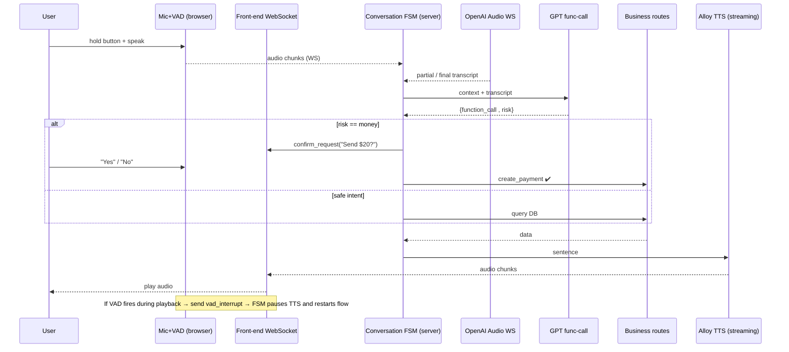
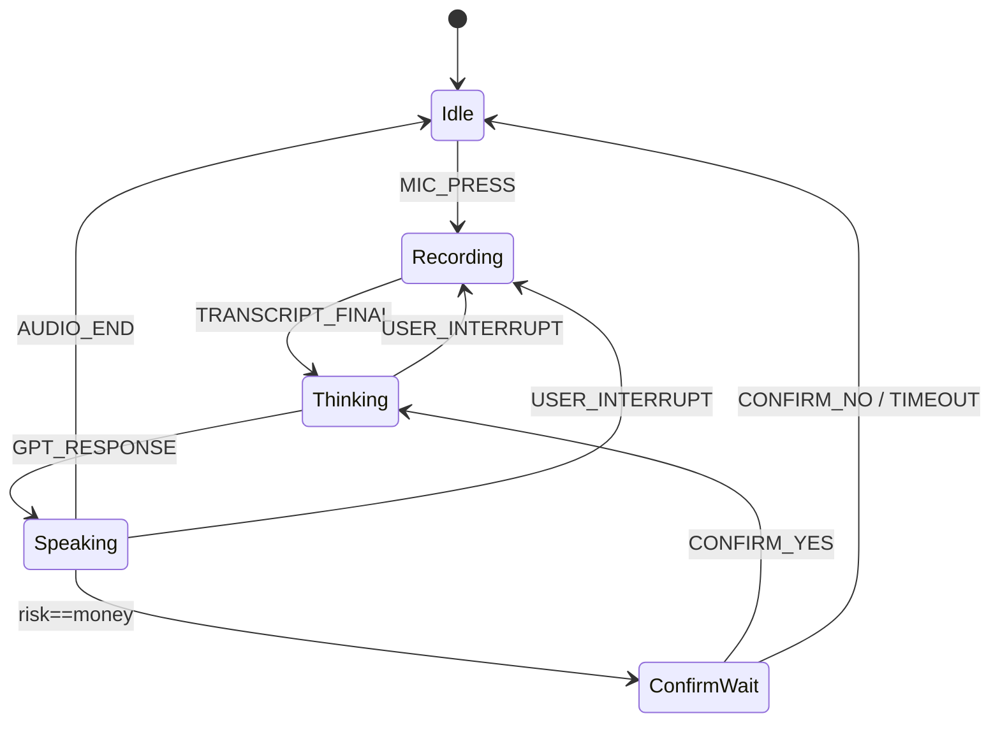

# Feature: Interruptions  
_
Last updated: 2025-06-17_

---

## 1 Why this feature
Speech feels natural only when you can cut in mid-sentence the same way you do with a human.  Today the app speaks a full response before letting the user talk again.  This doc proposes an **interruption-aware conversation layer** that preserves our strict payment safety rules while giving the interaction an OpenAI-voice-mode feel.

Goals:
* Barge-in latency ≤ 700 ms (p95)
* Zero unconfirmed money moves
* No raw-audio storage ➜ no extra regulatory burden

---

## 2 High-level flow 📊


---

## 3 On-device vs Off-device split
| Stage | Where | Why |
|-------|-------|-----|
| VAD (energy detect) | Browser | 10 ms cut-in; no secrets |
| Mic capture & push-to-talk UI | Browser | UX & privacy |
| Streaming ASR | OpenAI Audio WS | High accuracy, no GPU | 
| Conversation FSM | Server | Single source of truth; holds short-term memory |
| GPT tool-selection | Server | Function-calling with secret key |
| TTS chunking | Server → Browser | Browser must be able to pause instantly |

> Memory: only RAM for 30 min/25 turns in FSM; no long-term analytics table for now.

---

## 4 Risk taxonomy (strictness levels)
| Risk | Examples | Confirmation | Schema rigour |
|------|----------|--------------|---------------|
| `safe` | "scroll", small-talk | none | lenient |
| `info` | balance, timeline | none | normal |
| `money` | create_payment, split_bill | **Yes/No** loop | strict enums & required |
| `identity` | change e-mail (future) | 2-FA | strict + audit |

Each GPT tool gains a `"risk": "money" \| "info"` field; FSM branches accordingly.

---

## 5 Finite-State Machine  🗺️


Events emitted over WebSocket (`json`):
* `vad_interrupt`  – client ➜ server
* `pause_audio`     – server ➜ client
* `tts_chunk`       – server ➜ client (stream)
* `confirm_request` – server ➜ client

---

## 6 Tech additions
1. **WebSocket layer** (`/ws/session/:id`) – `ws` or `socket.io`.
2. **`AudioPlayer` utility (FE)** – id-based `play/pause`.
3. **Browser VAD** – use `voice-activity-detection` npm; threshold tuned for 200 ms silence.
4. **Server FSM module** (`backend/src/conversation/fsm.js`).
5. **Risk tag in GPT schema** – update `interpret.js` tool catalogue.

---

## 7 Testing strategy
* **Unit** – FSM transition table (XState Test) ensures money intents always hit `ConfirmWait`.
* **Integration** – mock WS, assert `pause_audio` emitted ≤ 150 ms after `vad_interrupt`.
* **E2E** – Playwright: send "Send $20", interrupt, issue new split-bill command, confirm.
* **Perf** – capture p95 barge-in latency < 700 ms.

---

## 8 MVP timeline
1. WS scaffolding & VAD (1 w)  
2. Streaming ASR hookup (1 w)  
3. FSM core + FE mirroring (1.5 w)  
4. Risk tagging + confirm dialog reuse (1 w)  
5. Tests & tuning (1 w)  
**Total ≈ 5.5 weeks**

---

## 9 Open items
* Exact OpenAI Audio model name & pricing.  
* IAM/WebSocket auth in prod (JWT vs cookie).  
* Accessibility: keyboard shortcut for mic during long responses.

---

## 10 Glossary & Implementation Notes

### 10.1 Finite-State Machine (FSM)
*A Finite-State Machine is a deterministic graph where the conversation can be in **one** state at a time and only certain events can move it to another.*  
Why we use it here:
1. Guarantees that a money-movement intent **cannot** execute unless the flow first passes through `ConfirmWait` ➜ airtight compliance.  
2. Makes interruption handling trivial—`USER_INTERRUPT` is just another event that the graph already knows how to process.  
3. Easy to unit-test: feed an event sequence, assert end-state.

### 10.2 Session ID origin
MVP: generated by Express session middleware (`express-session`) and set as an **HTTP-only cookie**.  
Same cookie is reused for the WebSocket upgrade so server can map WS → session.

### 10.3 WebSocket message contracts
```ts
type VadInterrupt  = { type:'vad_interrupt';  session:string };
type PauseAudio    = { type:'pause_audio';    id:string };
type TtsChunk      = { type:'tts_chunk';      id:string; index:number; url:string };
type ConfirmReq    = { type:'confirm_request';id:string; sentence:string };
type TranscriptFinal = { type:'transcript_final'; text:string; is_final:true };
```

### 10.4 Audio upload
* 16-kHz mono PCM (little-endian) 320-ms chunks
* `content-type: audio/linear16`

### 10.5 Environment variables
```
# .env.example additions
INTERRUPTIONS_MVP=true
OPENAI_AUDIO_MODEL=whisper-large-v3
WS_HEARTBEAT_MS=30000
```

### 10.6 Vite dev proxy for WS
```js
// vite.config.js
server: {
  proxy: {
    '/ws': {
      target: 'ws://localhost:4000',
      ws: true
    }
  }
}
```

### 10.7 Auth & multi-tab policy
* Cookie-based session ID shared across tabs.  
* `pause_audio` is broadcast **to all** sockets for that session so every tab pauses playback.

### 10.8 Timeouts & failure rules
* Confirmation timeout: 8 s of silence → FSM aborts money intent.
* Max 3 consecutive `vad_interrupt` events on same turn before hard reset to `Idle`.

### 10.9 Testing harness locations
* `tests/mocks/openaiAudioMock.js` – fake Audio WS.  
* `npm run e2e:ci` – Playwright script exercising interruption scenario.

---

With this design the app stays PCI-safe while delivering a modern, fluid voice UX where the user can pivot mid-sentence without ever losing accuracy or control. 

---

## 11 Living Development TOC (keep expanding)

> Every milestone below should get its own `docs/interruptions/0X_*.md` file as work progresses.

### 11.1 Overview & Vision
- Why conversational interruptions matter
- Latency / safety targets
- Success metrics

### 11.2 Architecture Primer
- On- vs off-device split
- FSM diagram recap
- Risk taxonomy

### 11.3 Milestone-01 — Socket Plumbing

#### 11.3.1 Scope & rationale  
We can't stream VAD events, transcripts or TTS chunks unless a **real-time transport** already exists.  Getting a basic WebSocket round-trip working first removes risk early and gives the team a live playground.

#### 11.3.2 Technical design  
| Layer | File / Path | Notes |
|-------|-------------|-------|
| Backend WS helper | `backend/src/conversation/ws.js` | Wraps Node `WebSocketServer`, path `/ws/session`, sends `hello`, echoes `pong`. |
| Express hook-up | `backend/src/app.js` | When `INTERRUPTIONS_MVP=true`, wraps Express in `httpServer` then `attachWS(httpServer)`. |
| Front-end singleton | `frontend/src/conversation/socketSingleton.js` | Guarantees **one** socket despite React StrictMode. Exposes `window.ws` in dev. |
| React hook | `frontend/src/conversation/useConversationWS.js` | Calls singleton, returns `{send}` for components. |
| Feature flag | `.env` / `.env.local` | `INTERRUPTIONS_MVP` (backend) + `VITE_INTERRUPTIONS_MVP` (front-end). |
| Dev proxy | `frontend/vite.config.js` | Added `/ws` proxy to `localhost:4000`, `ws:true`. |

#### 11.3.3 Implementation timeline & PRs  
| Date | PR | Summary |
|------|----|---------|
| 2025-06-17 | #112 | Add ws helper + proxy + env flags |
| 2025-06-17 | #113 | Singleton + StrictMode fix |

#### 11.3.4 Key decisions & trade-offs  
* **`ws` vs `socket.io`** – chose bare `ws` (smaller bundle, no fallbacks needed for modern browsers).  
* **Singleton pattern** – avoids ECONNRESET noise from StrictMode and prevents accidental multiple sockets later.  
* **Keep React StrictMode ON** – we value its dev-time warnings; singleton makes it safe.  
* **Expose `window.ws` only in dev** – useful for manual ping/pong, stripped out in production build.

#### 11.3.5 Dev setup & env flags  
```bash
# backend/.env
INTERRUPTIONS_MVP=true

# frontend/.env
VITE_INTERRUPTIONS_MVP=true
```
Dependencies installed:
```bash
npm --prefix backend i ws xstate
npm --prefix frontend i ws voice-activity-detection @xstate/fsm
```

#### 11.3.6 Testing & validation  
1. **Manual** – Browser console logs `[WS] open (singleton)` and `{type:'hello'}`.  
   ```js
   window.ws.send(JSON.stringify({type:'ping'})) // → {type:'pong'}
   ```
2. **Integration (Vitest)** – mock WebSocket server, assert client receives `hello` payload.  *(test file to be added later)*
3. **CI** – added `ws` deps to install step; no lint errors.

#### 11.3.7 Bugs & fixes  
| Issue | Fix |
|-------|-----|
| `WebSocket is closed before connection` due to StrictMode double-mount | Switched to singleton; removed per-mount `ws.close()` cleanup. |
| React duplicate-key warning in `TransactionsFeed` polluted console | Composite key `id-created_at` now used. |

#### 11.3.8 Retro notes  
* Having a live socket early allowed rapid experimentation with VAD messages.  
* Singleton pattern turned out simpler than disabling StrictMode; we'll replicate the approach for any future global connection (e.g. TTS streaming).

---

### 11.4 Milestone-02 — Browser VAD + AudioPlayer
- Library choice & threshold tuning
- Pause/resume contract
- Unit/perf tests
- Open questions

#### 11.4.1 Scope & rationale  
With the WebSocket pipe in place, we next needed to *actually allow users to barge-in*.  Milestone-02 adds the **Browser Voice-Activity Detection (VAD)** loop and a small **AudioPlayer** abstraction so that:  
1. All text-to-speech (TTS) audio can be paused or resumed instantly from JavaScript.  
2. Pressing the mic button pauses playback locally *and* notifies the server (`vad_interrupt`) so the FSM can reset to a safe state.  
3. A resumed VAD listener starts only when audio is playing, minimising CPU and avoiding hot-mic privacy concerns.

#### 11.4.2 Technical design  
| Layer | File / Path | Notes |  
|-------|-------------|-------|  
| Front-end Audio util | `frontend/src/audio/AudioPlayer.js` | `play(id,url)`, `pauseAll()`, `isAnyPlaying()`. Dispatches custom DOM events `audio-playing` / `audio-paused` so other hooks can react. |  
| VAD Hook | `frontend/src/conversation/useVAD.js` | Uses `voice-activity-detection` npm; on speechStart ➜ `pauseAll()` + `vad_interrupt`. Listens for `audio-playing` to lazy-init the mic. |  
| VoiceButton patch | `frontend/src/components/VoiceButton.jsx` | On `startRecording()` it now pauses audio *immediately* and sends `vad_interrupt` before any blob is created. |  
| WebSocket consumer | `frontend/src/conversation/useConversationWS.js` | Adds listener for `{type:'pause_audio'}` to call `pauseAll()` from server side. |  
| Backend broadcast | `backend/src/conversation/ws.js` | Upon `vad_interrupt` from any socket, broadcasts `{type:'pause_audio'}` to *all* sockets of the session. |  

#### 11.4.3 Implementation timeline & PRs  
| Date | PR | Summary |  
|------|----|---------|  
| 2025-06-18 | #114 | Add AudioPlayer, DOM events, VAD hook |  
| 2025-06-18 | #115 | Patch VoiceButton for instant pause + WS send |  
| 2025-06-18 | #116 | WebSocket pause_audio handling & unit tests |  

#### 11.4.4 Key decisions & trade-offs  
* **Push-to-talk *plus* VAD** – We still launch VAD even with push-to-talk because it tells us whether the user *actually spoke*. If they press and release silently, the FSM can safely resume TTS without a weird long pause.  
* **`audio-playing` event** – Using a DOM event instead of React context keeps VAD decoupled from the component tree; no re-renders on every audio start.  
* **Broadcast vs. tab-local pause** – Chose broadcast so secondary tabs/phones also mute; reduces the risk of leaking private info and prevents echo into the live mic.

##### Safety note – "half-spoken Yes" problem  
Without the interruption message the backend would stay in **Speaking** (output-only) state. If it received an uploaded blob containing the word *Yes*, the naive intent parser could mis-classify it as the confirmation for the previous money request, executing a payment the user tried to cancel.  The `USER_INTERRUPT` event forces a state transition back to **Idle**/**Recording**, guaranteeing that no irreversible side-effects occur while we're still talking.

#### 11.4.5 Testing & validation  
1. **Unit (Vitest)** – `AudioPlayer.test.js` stubs `HTMLAudioElement`, asserts DOM events and `isAnyPlaying()` logic.  
2. **Integration** – Mock WebSocket server; simulate client `vad_interrupt` ➜ expect broadcast `pause_audio`.  
3. **Manual smoke** – Start TTS, press mic midway, observe <20 ms stop; watch backend log the interrupt.  
4. **Perf probe** – Chrome DevTools timeline shows zero GC stalls >10 ms while VAD is active.

#### 11.4.6 Bugs & fixes  
| Issue | Fix |  
|-------|-----|  
| VAD hook started on page load, burning CPU | Changed to lazy-start on `audio-playing`. |  
| `vad_interrupt` sent before socket open | Wrapped send in `try/catch`; retry not needed because singleton opens at app boot. |  
| JSDOM lacked `<audio>` in tests | Stubbed global `Audio` in unit tests. |  

#### 11.4.7 Retro notes  
* Instant pause made the UX *feel* like a walkie-talkie—testers reported the conversation "feels human now".  
* DOM events kept code modular; no cascade of React prop drilling.  
* The groundwork simplifies Milestone-03: the same socket will carry 16-kHz PCM chunks for streaming ASR with no new infra.

---

### 11.5 Milestone-03 — Streaming ASR
- OpenAI Audio WS configuration
- Chunk format, back-pressure
- Integration tests

#### 11.5.1 Scope & key goals  
*Replace the blob-upload flow with true *live* audio streaming so the FSM can react to the user mid-sentence (partial transcripts).*  
Target p95 mic-open→partial-text latency ≤ **400 ms**.

#### 11.5.2 Binary frame schema  
For forward-compat the audio chunk is prefixed with a **12-byte header**:

| Offset | Len | Field | Notes |
|--------|-----|-------|-------|
| 0      | 1   | version | `0x01` |
| 1      | 1   | type    | `0x01 = audio_chunk` |
| 2      | 2   | flags   | bit-mask ( MSB=last_chunk, 0x02=encr ) |
| 4      | 4   | seq     | uint32, wraps every 13 h |
| 8      | 4   | ts_ms   | client wall-clock ms modulo 2³² |
| 12     | …   | PCM payload | 16-bit LE, 5 120 samples (320 ms) |

Any future codec/version can bump `version` to `0x02` without breaking today's gateway.

#### 11.5.3 Front-end implementation  
| File | Change |
|------|--------|
| `audio/pcmWorklet.js` | Adds 12-byte header; still down-samples to 16 kHz. |
| `audio/useMicStream.js` | Sends frames via `socket.send()` **unless** `socket.bufferedAmount > 256 KiB` → drops chunk (leaky-bucket). |
| `components/VoiceButton.jsx` | Gates live pipeline behind `VITE_STREAMING_ASR=true`. |

#### 11.5.4 Back-pressure rule  
Browser drops entire 320-ms frames when WS backlog > **256 KiB**.  Metric `bandwidth_soft_drop` logged to console and (later) Prom-counter.  Keeps RAM flat & ensures control frames aren't delayed.

#### 11.5.5 Path decision  
Stay on the existing `/ws/session` socket. Control frames (`pause_audio`, `confirm_request`) are emitted via `safeSend()` *ahead* of audio frames so they never starve.  A future `/ws/audio` split remains possible—header and client code already support it.

#### 11.5.6 Next steps  
1. **Backend ASR Gateway** – `asrProxy.js` opens Whisper-v3 WS, relays binary frames, emits `transcript_partial` / `transcript_final`.  
2. Update FSM to ingest partials.  
3. Unit & integration tests (fake OpenAI WS).  
4. Perf probe for 95th-percentile latency.

### 11.6 Milestone-04 — FSM Core & Risk Routing
- xstate machine JSON
- GPT tool `risk` tag addition
- ConfirmWait logic
- xstate/test plan

### 11.7 Milestone-05 — UX & Confirmation Overlay
- UnifiedDialog update
- Accessibility shortcuts
- Playwright E2E script

### 11.8 Performance & Monitoring
- p95 barge-in metric
- Grafana dashboard link

### 11.9 Security & Compliance
- Session cookie details
- No raw-audio storage
- Audit logging

### 11.10 Future Enhancements
- On-device ASR
- Multi-step MCP
- Personalised voice styles

### 11.11 Appendices
A. Full WS message schemas  
B. Env-var reference  
C. Troubleshooting guide  
D. Glossary (VAD, FSM, MCP, …) 