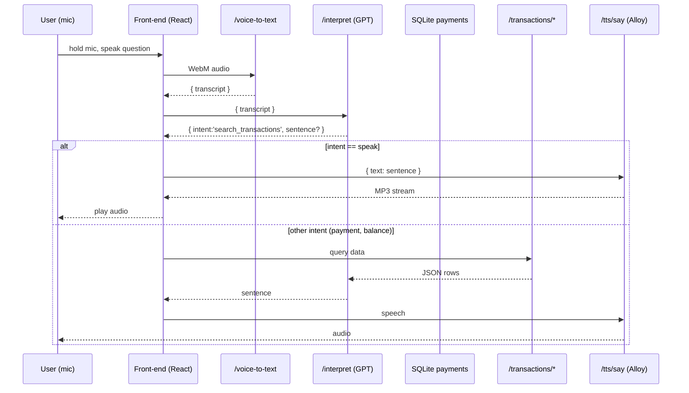

# Voice Payments – Ask-Anything Edition (v0.3.0)

Money should move at the speed of conversation.  This repo shows how to turn **speech → intent → Stripe** into a fully-featured developer prototype using Whisper, GPT function-calling, Alloy TTS and a local SQLite mirror for lightning-fast queries.

> “Show me my failed charges over fifty dollars.”  
> “How much revenue did we make today?”  
> “What's the status of payment intent _pi_3RZiF…_?”

All answered aloud in under a second.

---

## 1 What's new in v0.3.0

| Area | Upgrade |
|------|---------|
| Data | SQLite mirror populated by Stripe webhooks (`/webhooks/stripe`) |
| API  | Flexible search (`/api/transactions/search`) & aggregate (`/aggregate`) endpoints |
| AI   | New GPT tools: `search_transactions`, `aggregate_transactions` |
| Voice| Generic speech playback helper; any backend sentence → Alloy TTS → `<audio>` |
| UI   | Robin-hood style timeline feed + global `TransactionsContext` |

---

## 2 Feature matrix & details

| # | Capability | User speaks… | System does | Tech bits |
|---|------------|--------------|-------------|-----------|
| 1 | Natural-language payments | “Send twenty dollars to Teja” | Whisper → GPT → `create_payment` → Stripe Checkout link | `create_payment` tool, `routes/createPayment.js` |
| 2 | Voice confirmation | “Yes” / “No” answer to Alloy prompt | Modal + Alloy TTS prompt then `/voice-confirm` | `tts/confirm`, `voiceConfirm.js` |
| 3 | Balance enquiry | “What's my pending balance?” | Uses cached `/api/balance`, speaks amount | `BalanceContext`, generic `/tts/say` |
| 4 | Timeline feed | — | Infinite scroll of recent payments | `TransactionsContext`, `/api/transactions` |
| 5 | Free-form search | “List failed charges over fifty dollars” | GPT → `search_transactions` → sentence → speak | `/transactions/search`, dynamic SQL |
| 6 | Aggregated stats | “How much revenue this month?” | GPT → `aggregate_transactions` → totals → speak | `/transactions/aggregate`, formatter |
| 7 | Multi-currency awareness | “Show me CAD payments only” | Currency filter in both search & aggregate | `currency` param everywhere |
| 8 | Amount filters | “over fifty dollars”, “below $5” | `min_amount_cents`, `max_amount_cents` | Same search route |
| 9 | Date filters | “from last Monday”, “today”, “this week” | Approx date parsing -> period param | Built-in period map |
|10 | Low-latency audio | Any sentence | Alloy TTS, cached MP3 blob, reused `<audio>` | `playAudio.js` cache Map |

> 💡 **Business impact** – Together these features replicate 90 % of Stripe Dashboard's "Payments" tab hands-free, cutting lookup time from ~30 s (open laptop, filter UI) to <2 s spoken.

---

## 3 Quick-start (dev)

```bash
# 1. backend env
cp backend/.env.example backend/.env
#   add STRIPE_SECRET_KEY, STRIPE_WEBHOOK_SECRET, OPENAI_API_KEY

# 2. start API
cd backend && npm install && npm run dev

# 3. forward Stripe events
stripe login                      # one-time browser OAuth
stripe listen --events payment_intent.* \
             --forward-to localhost:4000/webhooks/stripe

# 4. start front-end
cd ../frontend && npm install && npm run dev
```

(optional) generate a test payment:
```bash
stripe trigger payment_intent.succeeded
```
Watch the feed update and Alloy announce the new payment ("Cha-ching…").

---

## 4 Environment variables

| Variable | Used In | Purpose |
|----------|---------|---------|
| `STRIPE_SECRET_KEY` | backend routes | Verify webhooks & future Stripe API calls |
| `STRIPE_WEBHOOK_SECRET` | `stripeWebhook.js` | Signature validation |
| `OPENAI_API_KEY` | Whisper, GPT, Alloy | All LLM & TTS calls |
| `OPENAI_CHAT_MODEL` (opt) | `/interpret` | Switch GPT model |
| `DB_PATH` (opt) | `utils/db.js` | Custom SQLite location |

`backend/.env.example` contains placeholders for all of the above.

---

## 5 Database schema

```sql
CREATE TABLE payments (
  id TEXT PRIMARY KEY,
  amount INTEGER,          -- cents
  currency TEXT,
  status TEXT,             -- succeeded, failed …
  description TEXT,
  card_brand TEXT,
  last4 TEXT,
  created_at TEXT,         -- ISO8601
  updated_at TEXT
);
CREATE INDEX payments_created_at_idx ON payments(created_at);
CREATE INDEX payments_status_idx      ON payments(status);
```
The DB lives in `backend/data/stripe.db` (or `DB_PATH`).  All read queries are sub-millisecond.

---

## 6 Route reference

### 6-A.  Inbound (Stripe → backend)
| Method | Path | Body | Purpose |
|--------|------|------|---------|
| POST | `/webhooks/stripe` | raw Stripe event | UPSERT into `payments` & broadcast `new_payment` (future) |

### 6-B.  Public REST (frontend ↔ backend)
| Method | Path | Params / Body | Description |
|--------|------|---------------|-------------|
| GET | `/api/transactions` | limit, starting_after | Infinite-scroll feed |
| POST | `/api/transactions/search` | JSON filters | Flexible finder |
| GET | `/api/transactions/aggregate` | period, status, currency | Totals & averages |
| *(legacy)* | `/api/balance` etc. | | Older voice features |

### 6-C.  Voice layer
| Method | Path | Purpose |
| POST | `/api/voice-to-text` | Whisper transcription |
| POST | `/api/interpret` | GPT function-calling |
| POST | `/api/tts/say` | Alloy TTS MP3 stream |

---

## 7 GPT function catalogue

```jsonc
create_payment            // v0.1
query_balance             // v0.2
search_transactions       // v0.3
aggregate_transactions    // v0.3
```
Detailed JSON schemas live inside `backend/src/routes/interpret.js`.

---

## 8 Flow walkthrough



🕑 **Latency budget**
| Segment | Typical |
| Whisper 10 s | 1.3 s |
| GPT parse   | 0.4 s |
| SQLite read | <2 ms |
| Alloy TTS   | 0.7 s |
| Playback    | 0.1 s |

---

## 9 Code highlights

* `backend/src/utils/db.js` – lazy-loads `better-sqlite3`, auto-migrates.
* `backend/src/routes/transactionsSearch.js` – dynamic `WHERE` builder.
* `backend/src/routes/transactionsAggregate.js` – period-aware totals.
* `backend/src/utils/formatters.js` – deterministic English sentences.
* `frontend/src/utils/playAudio.js` – sentence→MP3 cache.
* `frontend/src/components/VoiceButton.jsx` – one intent handler to rule them all.

---

## 10 Error-handling cheatsheet

| Error | Likely fix |
|-------|------------|
| 400 `Webhook signature failed` | Check `STRIPE_WEBHOOK_SECRET` |
| 422 `parse_incomplete` | Speak more clearly; GPT lacked parameters |
| 500 `TTS request failed` | Verify `OPENAI_API_KEY` quota |

---

## 11 Tests & CI

Run locally:
```bash
# backend
cd backend && npm test
# frontend
cd ../frontend && npm test
```
GitHub Actions executes the same; coverage must stay green.

---

## 12 Roadmap (highlights)

* WebSocket push ➜ live "Cha-ching" alerts.
* SSML support for better pronunciation.
* Multi-currency conversion via Stripe FX rates.

---

## 13 License & Conduct

MIT License + Contributor Covenant 2.1 – see original sections.
