# Voice Payments – Ask-Anything Edition (v0.3.0)

Money should move at the speed of conversation.  This repo shows how to turn **speech → intent → Stripe** into a fully-featured developer prototype using Whisper, GPT function-calling, Alloy TTS and a local SQLite mirror for lightning-fast queries.

> "Show me my failed charges over fifty dollars."  
> "How much revenue did we make today?"  
> "What's the status of payment intent _pi_3RZiF…_?"

All answered aloud in under a second.

---

## 1 What's new in v0.3.0

| Area | Upgrade |
|------|---------|
| Data | SQLite mirror populated by Stripe webhooks (`/webhooks/stripe`) |
| API  | Flexible search (`/api/transactions/search`) & aggregate (`/aggregate`) endpoints |
| AI   | New GPT tools: `search_transactions`, `aggregate_transactions` |
| Voice| Generic speech playback helper; any backend sentence → Alloy TTS → `<audio>` |
| UI   | Robin-hood style timeline feed + global `TransactionsContext` |

---

## 1.1 Patch v0.3.1 (2025-06-15) – Dev-proxy & Timeline Bug-fix

| Reason | Change | File(s) |
|--------|--------|---------|
| Front-end 404s on `/api/transactions` | Added Vite dev-server proxy so any request beginning with `/api` is forwarded to the Express backend on port 4000. | `frontend/vite.config.js` (`server.proxy` block) |
| Backend mount mismatch | Mounted `transactionsRouter` at `/api/transactions` (was `/api`) so the final path resolves to `/api/transactions` as documented. | `backend/src/app.js` |
| Infinite fetch loop in React | The two fixes above turn previous 404 responses into 200, stopping the exponential re-tries in `useTransactions` and allowing the timeline component to render. | — |

### Debug walkthrough (for the curious)
1. **Symptom** – DevTools showed endless `404 /api/transactions?limit=25` plus React errors.
2. **Hypothesis** – Either the proxy was missing or the server route path was wrong.
3. **Confirmation**
   • `curl http://localhost:4000/api/transactions` returned JSON ➜ route exists.<br/>
   • Same URL via browser on port 5173 returned 404 ➜ proxy missing.<br/>
4. **Fix 1** – Added Vite proxy.<br/>
5. **Symptom persisted** – Now the browser hit `GET /api/transactions` on the backend and still saw 404. <br/>
6. **Fix 2** – Realised router was mounted at `/api`, not `/api/transactions`; remounted correctly.
7. **Result** – 200 OK, timeline feed populates, GPT "show my recent transactions" now succeeds.

> Take-away: Always line-up **front-end fetch path → dev proxy → Express mount path**. A one-character drift causes silent 404s that look like "broken React".

---

## 1.2 Patch v0.3.2 (2025-06-16) – Stripe sync & enriched timeline

| Reason | Change | File(s) |
|--------|--------|---------|
| Stripe ↔ SQLite drift | On-boot back-fill helper `syncStripePayments` pulls recent PaymentIntents so the local mirror always matches the Dashboard. | `backend/src/utils/stripeSync.js`, `backend/src/app.js` |
| Show customer in feed | Added `customer_email` column, captured by webhook & back-fill. | `backend/src/utils/db.js`, `stripeWebhook.js` |
| Timeline UI lacked e-mail | Feed renders e-mail under amount. | `frontend/TransactionsFeed.jsx` |
| Filter via URL | `/api/transactions` now supports `?status=succeeded|failed|all` for lighter payloads. | `backend/routes/transactions.js` |

---

## 2 Feature matrix & details

| # | Capability | User speaks… | System does | Tech bits |
|---|------------|--------------|-------------|-----------|
| 1 | Natural-language payments | "Send twenty dollars to Teja" | Whisper → GPT → `create_payment` → Stripe Checkout link | `create_payment` tool, `routes/createPayment.js` |
| 2 | Voice confirmation | "Yes" / "No" answer to Alloy prompt | Modal + Alloy TTS prompt then `/voice-confirm` | `tts/confirm`, `voiceConfirm.js` |
| 3 | Balance enquiry | "What's my pending balance?" | Uses cached `/api/balance`, speaks amount | `BalanceContext`, generic `/tts/say` |
| 4 | Timeline feed | — | Infinite scroll of recent payments | `TransactionsContext`, `/api/transactions` |
| 5 | Free-form search | "List failed charges over fifty dollars" | GPT → `search_transactions` → sentence → speak | `/transactions/search`, dynamic SQL |
| 6 | Aggregated stats | "How much revenue this month?" | GPT → `aggregate_transactions` → totals → speak | `/transactions/aggregate`, formatter |
| 7 | Multi-currency awareness | "Show me CAD payments only" | Currency filter in both search & aggregate | `currency` param everywhere |
| 8 | Amount filters | "over fifty dollars", "below $5" | `min_amount_cents`, `max_amount_cents` | Same search route |
| 9 | Date filters | "from last Monday", "today", "this week" | Approx date parsing -> period param | Built-in period map |
|10 | Low-latency audio | Any sentence | Alloy TTS, cached MP3 blob, reused `<audio>` | `playAudio.js` cache Map |

💡 **Business impact** – Together these features replicate 90 % of Stripe Dashboard's "Payments" tab hands-free, cutting lookup time from ~30 s (open laptop, filter UI) to <2 s spoken.

---

## 3 Quick-start (dev)

```bash
# 1. backend env
cp backend/.env.example backend/.env
#   add STRIPE_SECRET_KEY, STRIPE_WEBHOOK_SECRET, OPENAI_API_KEY

# 2. start API
cd backend && npm install && npm run dev

# 3. forward Stripe events
stripe login                      # one-time browser OAuth
stripe listen --events payment_intent.* \
             --forward-to localhost:4000/webhooks/stripe

# 4. start front-end
cd ../frontend && npm install && npm run dev
```

(optional) generate a test payment:
```bash
stripe trigger payment_intent.succeeded
```
Watch the feed update and Alloy announce the new payment ("Cha-ching…").

---

## 4 Environment variables

| Variable | Used In | Purpose |
|----------|---------|---------|
| `STRIPE_SECRET_KEY` | backend routes | Verify webhooks & future Stripe API calls |
| `STRIPE_WEBHOOK_SECRET` | `stripeWebhook.js` | Signature validation |
| `OPENAI_API_KEY` | Whisper, GPT, Alloy | All LLM & TTS calls |
| `OPENAI_CHAT_MODEL` (opt) | `/interpret` | Switch GPT model |
| `DB_PATH` (opt) | `utils/db.js` | Custom SQLite location |

`backend/.env.example` contains placeholders for all of the above.

---

## 5 Database schema

```sql
CREATE TABLE payments (
  id TEXT PRIMARY KEY,
  amount INTEGER,          -- cents
  currency TEXT,
  status TEXT,             -- succeeded, failed …
  description TEXT,
  card_brand TEXT,
  last4 TEXT,
  customer_email TEXT,
  created_at TEXT,         -- ISO8601
  updated_at TEXT
);
CREATE INDEX payments_created_at_idx ON payments(created_at);
CREATE INDEX payments_status_idx      ON payments(status);
```
The DB lives in `backend/data/stripe.db` (or `DB_PATH`).  All read queries are sub-millisecond.

---

## 6 Route reference

### 6-A.  Inbound (Stripe → backend)
| Method | Path | Body | Purpose |
|--------|------|------|---------|
| POST | `/webhooks/stripe` | raw Stripe event | UPSERT into `payments` & broadcast `new_payment` (future) |

### 6-B.  Public REST (frontend ↔ backend)
| Method | Path | Params / Body | Description |
|--------|------|---------------|-------------|
| GET | `/api/transactions` | limit, starting_after, **status** | Infinite-scroll feed |
| POST | `/api/transactions/search` | JSON filters | Flexible finder |
| GET | `/api/transactions/aggregate` | period, status, currency | Totals & averages |
| *(legacy)* | `/api/balance` etc. | | Older voice features |

### 6-C.  Voice layer
| Method | Path | Purpose |
| POST | `/api/voice-to-text` | Whisper transcription |
| POST | `/api/interpret` | GPT function-calling |
| POST | `/api/tts/say` | Alloy TTS MP3 stream |

---

## 7 GPT function catalogue

```jsonc
create_payment            // v0.1
query_balance             // v0.2
search_transactions       // v0.3
aggregate_transactions    // v0.3
```
Detailed JSON schemas live inside `backend/src/routes/interpret.js`.

---

## 8 Flow walkthrough


🕑 **Latency budget**
| Segment | Typical |
| Whisper 10 s | 1.3 s |
| GPT parse   | 0.4 s |
| SQLite read | <2 ms |
| Alloy TTS   | 0.7 s |
| Playback    | 0.1 s |

---

## 9 Code highlights

* `backend/src/utils/db.js` – lazy-loads `better-sqlite3`, auto-migrates.
* `backend/src/routes/transactionsSearch.js` – dynamic `WHERE` builder.
* `backend/src/routes/transactionsAggregate.js` – period-aware totals.
* `backend/src/utils/formatters.js` – deterministic English sentences.
* `frontend/src/utils/playAudio.js` – sentence→MP3 cache.
* `frontend/src/components/VoiceButton.jsx` – one intent handler to rule them all.

---

## 10 Error-handling cheatsheet

| Error | Likely fix |
|-------|------------|
| 400 `Webhook signature failed` | Check `STRIPE_WEBHOOK_SECRET` |
| 422 `parse_incomplete` | Speak more clearly; GPT lacked parameters |
| 500 `TTS request failed` | Verify `OPENAI_API_KEY` quota |

---

## 11 Tests & CI

Run locally:
```bash
# backend
cd backend && npm test
# frontend
cd ../frontend && npm test
```
GitHub Actions executes the same; coverage must stay green.

---

## 12 Roadmap (highlights)

* WebSocket push ➜ live "Cha-ching" alerts.
* SSML support for better pronunciation.
* Multi-currency conversion via Stripe FX rates.

---

## 13 License & Conduct

MIT License + Contributor Covenant 2.1 – see original sections.

## 14 Demo script & live checklist

### 14-A Pre-flight checks

| Check | Command / Action | Expected |
|-------|------------------|----------|
| Homebrew installed | `brew --version` | prints version |
| FFmpeg for Whisper | `ffmpeg -version` \| `brew install ffmpeg` | prints version |
| Stripe CLI | `stripe version` | prints 1.x.y |
| OpenAI quota | `curl https://api.openai.com/v1/dashboard/billing/credit_grants -H "Authorization: Bearer $OPENAI_API_KEY"` | JSON with >0 credits |
| Mic permission (macOS) | System Settings → Privacy & Security → Microphone | Browser is toggled **on** |

### 14-B Run-of-show (5 min)

| Step | You do | Audience sees | Audience hears |
|------|--------|--------------|----------------|
| 1 | 🎤 "How much revenue did we make today?" | No UI change | Alloy: total revenue sentence |
| 2 | 🎤 "List failed charges over fifty dollars." | Red `Failed` row highlighted | Alloy lists failed row(s) |
| 3 | 🎤 "What's my available balance?" | Balance bar pulses | Alloy speaks amount |
| 4 | 🎤 "Send twenty dollars to Alex." → 🎤 "Yes" | Modal → Checkout link | Alloy confirmation prompt |
| 5 | Trigger `stripe trigger payment_intent.succeeded` in terminal | New green row pops | (optional WS) "Cha-ching!" |

### 14-C Test-card cheat-sheet

| Scenario | Payment method id | Effect |
|----------|-------------------|--------|
| Success | `pm_card_visa` | `payment_intent.succeeded` |
| Declined | `pm_card_chargeDeclined` | `payment_intent.payment_failed` |
| 3-D Secure | `pm_card_authenticationRequired` | Checkout shows challenge |

### 14-D Common rescue maneuvers

* **Mic blocked** – flip the browser toggle in macOS privacy, reload page.
* **Webhook silent** – confirm `stripe listen` is running & `STRIPE_WEBHOOK_SECRET` matches.
* **TTS 401/429** – check remaining OpenAI credits with command above.
* **Better-sqlite missing** – `npm install better-sqlite3` inside `backend`.

> With these items checked, the end-to-end demo runs in 
> < 2 seconds per question and no internet besides Stripe + OpenAI APIs.

---

## Appendix A Consistent Spoken Responses (v0.4)

Speech output is now generated in a single, predictable way so that:

* **UX stays familiar** – every balance or list sentence follows the same rhythm.
* **Unit-testing is trivial** – deterministic strings, no React logic involved.
* **Localisation** is one file away – swap templates, keep the rest of the stack.
* **SSML / prosody tweaks** later require touching only the template helpers.

### Key Modules

| File | Responsibility |
|------|----------------|
| `backend/src/utils/moneyWords.js` | Converts integer cents → English words using `number-to-words`.  CJS module, imported via default export: `import toWordsPkg …; const { toWords } = toWordsPkg;`. |
| `backend/src/utils/speechTemplates.js` | Pure functions that turn raw numbers / rows into **complete** sentences, e.g. `balanceSentence`, `listSentence`. |
| `backend/src/utils/formatters.js` | Helpers that adapt DB rows or aggregates before handing them to the templates. |
| `backend/src/routes/interpret.js` | GPT function-calling branch; fetches any required data, calls the templates, then returns `{ intent:'speak', sentence }`. |
| `backend/src/routes/ttsSay.js` | Turns a sentence into Alloy MP3 using OpenAI TTS.  Stateless, cache lives in the browser. |
| `frontend/src/utils/playAudio.js` | Browser-side cache + `<audio>` player.  Front-end **never** pieces sentences together. |

### End-to-End Flow

```mermaid
sequenceDiagram
  participant Mic
  participant FE as Front-end
  participant API
  participant GPT
  participant DB
  participant TTS

  Mic->>FE: user speech (webm)
  FE->>API: /voice-to-text
  API->>GPT: Whisper transcript → chat
  GPT-->>API: function_call e.g. <query_balance>
  API->>DB: fetch rows / cents
  DB-->>API: JSON
  API->>API: template → sentence
  API-->>FE: { intent:"speak", sentence }
  FE->>TTS: /api/tts/say { text }
  TTS-->>FE: mp3 stream
  FE->>Mic: 🔊 play audio
```



### Extending

```js
// Add a new spoken reply, e.g. monthly revenue
export function revenueSentence({ period, totalCents }) {
  return `Your revenue for ${period} is ${moneyToWords(totalCents)}.`;
}
```
Touching a single helper makes the new phrasing available to GPT, the REST layer and the test-suite.

### Edge-cases Covered

* amounts = 0 → "zero dollars"  
* singular vs plural cents/dollars  
* negative values prepend "minus" (refunds)
* zero totals and $0 transactions now speak "zero dollars" instead of truncating

> With this appendix you can onboard a teammate in 30 s: "All speech lives in `speechTemplates.js`; the front-end just plays MP3s."

---
