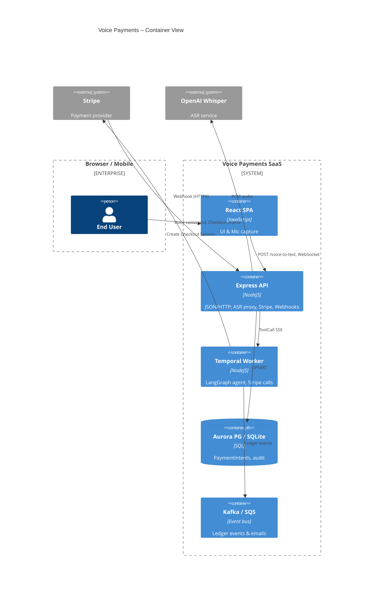
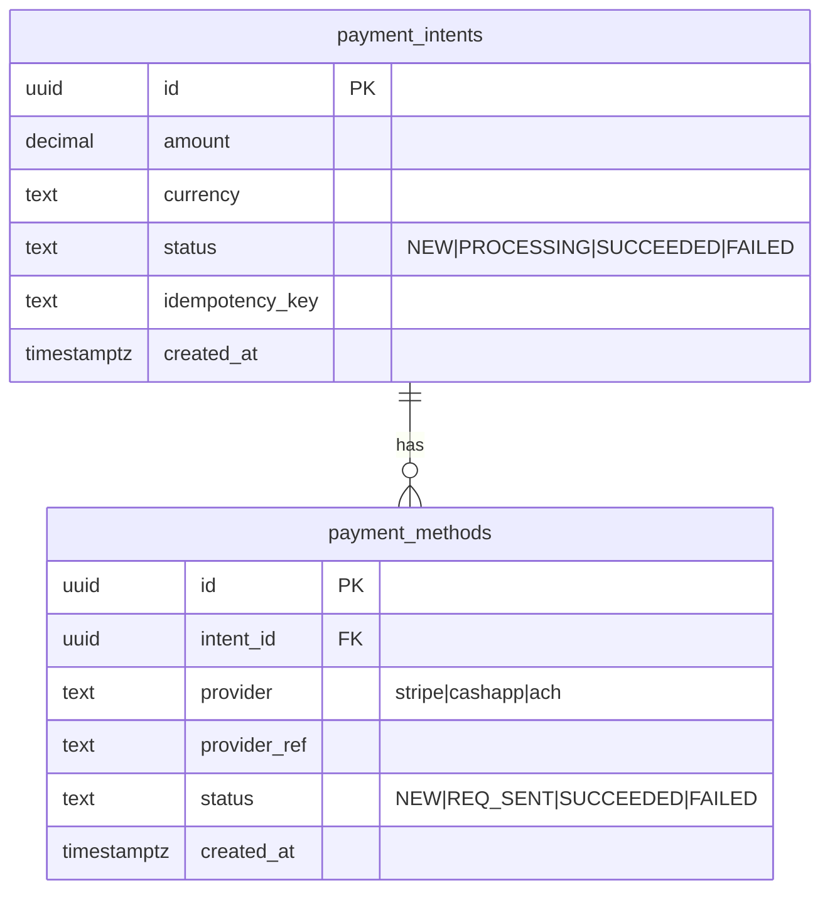
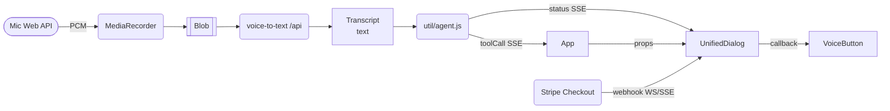
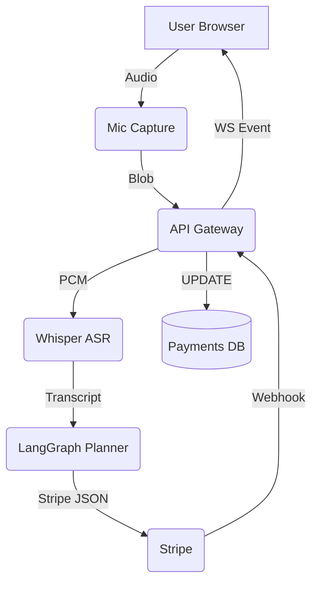

# Voice Payments · Tech Vision 2025 Study Guide

## Table of Contents  <a name="table-of-contents"></a>

[TOC] <!-- many Markdown plugins will auto-replace this marker with a live linked TOC -->

> **Hand-rolled outline** – quick links for GitHub readers (click to jump)
> 
> * [Chapter 1 – Vision & Problem Space](#chapter-1--vision--problem-space)
> * [Chapter 2 – User-Facing Flow](#chapter-2--user-facing-flow--mic-to-payment-confirmed)
> * [Chapter 3 – Backend Services & Data](#chapter-3--backend-services--data--express-esm-sqlite-mirror-webhooks--idempotency)
> * [Chapter 4 – The "Brain" (Agents & LangGraph)](#chapter-4--the-brain--agents-langchain-vs-langgraph-memory-tiers--planner-actor-patterns)
> * [Chapter 5 – Front-End Architecture](#chapter-5--front-end-architecture--react--vite--tailwind-streaming-ux--accessibility)
> * [Chapter 6 – Security, Compliance & Ops](#chapter-6--security-compliance--operations--from-threat-model-to-dr--cost-controls)
> * [Chapter 7 – Scaling & Cost Roadmap](#chapter-7--scaling--cost-roadmap--from-mvp-to-10k-tps)

## Quick-start (5 minutes) <a name="quick-start"></a>

```bash
# 1. Clone & bootstrap
$ git clone https://github.com/your-org/voice-payments.git
$ cd voice-payments
$ npm run bootstrap         # installs backend + frontend deps via workspaces

# 2. Fire up the complete stack (Vite + Express + SQLite)
$ make dev                  # equivalent to  (cd backend && npm run dev)  &  (cd frontend && npm run dev)

# 3. Validate a hello-world voice command
$ curl -F audio=@samples/hello.webm \
       http://localhost:4000/api/voice-to-text | jq
# → { "transcript": "hello world" }

# 4. Run the test suite
$ npm test                  # vitest + jest-style reporters
```

Why these steps?
1. **Single make target** keeps ports aligned (4000 backend, 5173 frontend).  
2. **SQLite file** lives in `backend/data/stripe.db` so no external DB needed.  
3. The sample blob proves your microphone isn't required for a first smoke-test.

## Chapter 1  Vision & Problem Space  
*A conceptual primer for beginners – from zero to informed contributor*

---

### 1 · The Big Idea
People speak **3× faster** than they type and make far fewer errors when the interface understands natural language.  
Our goal is to let a customer say: *"Hey app, split tonight's bill – $120, four people, add 18 % tip"* and be done.  
Behind the scenes the app must:
1. **Hear** the words (speech-to-text).  
2. **Understand** the intent (LLM reasoning).  
3. **Act** on that intent (call Stripe, store records).  
4. **Confirm** the result (text-to-speech + UI update).  
The architecture we adopt delivers these steps in < 2 s while keeping PCI scope, cost, and compliance in check.

### 2 · Why Voice & Agents – A Quick Analogy
Think of the app as a polite concierge in a hotel lobby:
* The **guest** blurts out an ambiguous request ("Need a ride to the airport, and can you add it to my room?").
* The **concierge** figures out the services needed (book taxi + update room bill), talks to the right counters, and keeps the guest updated.

A classic REST API is like a **kiosk** – great if you already know which exact form to fill.  
An **agent** is the concierge – it interprets fuzzy requests, decomposes them into steps, and loops for clarification if details are missing.

Sundar Balamurugan's 2025 guide lists autonomy, planning, memory, tool invocation, and reflection as the pillars of an AI agent [1]. Those traits map 1-to-1 onto our product needs.

### 3 · Success Criteria (lifted from TECH_VISION_2025)
| Objective | Concrete KPI | Why it matters |
|-----------|--------------|----------------|
| **Bank-grade MCP Gateway** | One API for cards, ACH, wallets by Q3 2025 | Future-proof payment methods |
| **Stripe Showcase** | Featured on stripe.com/showcase | Marketing & credibility |
| **Regulated-ready audit** | 100 % reproducible workflows in Temporal | Fin-tech compliance |
| **Latency** | P99 < 2 s from voice end → Checkout link | User experience |
| **Cost ceiling** | ≤ $5/month typical dev infra | Boot-strapped affordability |

### 4 · Stakeholders & Their Jobs-To-Be-Done
* **End User** – pay or request money hands-free, trust it worked.  
* **Merchant** – receive a payment link + webhook status without extra integration.  
* **Compliance Officer** – prove every cent and every decision path.  
* **DevOps** – ship changes safely, roll back quickly.  
Mapping stakeholder needs early prevents "bolt-on" fixes later.

### 5 · Why an *Agentic* Architecture Beats Rule-Based NLP
| Challenge | Rule-Based Bot | Agentic LLM+Tools |
|-----------|---------------|--------------------|
| Paraphrases & slang | Explosion of regex patterns | Few-shot generalisation |
| Multi-step tasks | Hard-coded dialog trees | Dynamic planning & reflection |
| New payment method | Re-write intent parser | Add new tool, reuse planner |
| Auditability | Sparse logs | Deterministic LangGraph replay |

Alvaro Duran warns that payment systems grow messy when you cram new flows onto a card-first model [2]. Agents keep business logic in loosely-coupled *tools*, avoiding that trap.

### 6 · High-Level Component Map
```
[User mic] → Whisper ASR → LLM ("Brain") → LangGraph Planner ─┐
                                                          │
                                 ┌───────── Stripe Checkout ◀── MCP-Payment Tool
                                 │
React UI ◀── Web-Socket Stream ◀──┘
            ▲                          │
            │                          └── SQLite Mirror / Postgres   (records)
            └── Text-to-Speech (TTS) ◀───────────────────────────────────────────
```
Colour-by-role:  
• *Blue* = Voice & reasoning (client-heavy).  
• *Orange* = Money movement (server & Stripe).  
• *Green* = Persistence / audit.

### 7 · How the Pieces Fit & Benefit Table
| Layer | Main Tech | Why this choice? | Benefit |
|-------|-----------|------------------|---------|
| Voice → Text | OpenAI Whisper | State-of-the-art accuracy, runs local if privacy needed | Fewer mis-heard amounts |
| Reasoning | GPT-4-Turbo / Claude-Sonnet | Handles fuzzy requests | Less brittle |
| Planning | **LangGraph** | Typed graph, replayable | Audit & debugging |
| Tool layer | MCP catalogue (Stripe, RAG, balance) | Swappable integrations | Faster new features |
| Workflow | Temporal (phase-2) | Guarantees & retries | Compliance & resilience |
| UI | React + Vite + Tailwind | Modern DX | Rapid iteration |
| DB | SQLite dev → Aurora PG → TigerBeetle | Crawl-walk-run path | Cost → scale |

### 8 · Alternatives Considered & Trade-Offs
1. **Local LLM only** – Cheaper long-term but mobile devices choke; you lose server-side memory.  
2. **Form-based checkout** – Familiar UI but defeats voice value-prop.  
3. **Single Payment table** – Quicker schema but violates Intent-Method separation, leading to recurring bugs (double charges, refund ambiguity).  
4. **Kafka event mesh from day 1** – Elegant, but ops overkill for pre-product-market-fit.

### 9 · Concept Check (Self-Quiz)
1. In your own words, why does a voice interface *need* an agent instead of a fixed intent parser?  
2. How does Stripe Checkout shrink our **PCI scope**?  
3. Name two design choices that make audits easier.  
4. Describe the *Intent–Method* split in a sentence.

*(Answers live in the README footnotes – peek only after you try.)*

---
### Footnotes & References
[1] Sundar Balamurugan, "AI Agents: The Quick Guide You Need in 2025" (Medium, Apr 2025).  
[2] Alvaro Duran, "5 Common Antipatterns in Payment Systems Design" (The Payments Engineer Playbook, Apr 2025).

> **Next up → Chapter 2: User-Facing Flow** – microphone to "Payment confirmed". 

---

# Chapter 2  User-Facing Flow — Mic to "Payment confirmed"
*A step-by-step narrative of what happens from the moment a user taps the voice button to the final confirmation screen.*

> Learning goals
> 1. Visualise the entire request/response timeline.  
> 2. Understand which component owns which responsibility.  
> 3. Recognise latency hotspots and failure modes.  
> 4. Build mental hooks for later deep-dives (ASR, LLM, Stripe, Webhooks).

## 1 · Quick Tour in 10 Seconds
```
[ 🎙️ Tap ]
   ↓
🖥️  Browser captures audio (MediaStream)
   ↓ (WS chunks)
🟦 Whisper ASR service → "split $120 four people"
   ↓
🧠  LLM agent (LangGraph) → decides `payment.split.create`
   ↓
🔑  Server calls Stripe → Checkout Session URL
   ↓
📲  Front-end opens Stripe Checkout → user pays
   ↓ (webhook)
✅  Server confirms → UI dialog shows "Payment confirmed" + TTS
```

## 2 · Detailed Timeline & Responsibilities
| # | Time (approx) | Component | Responsibility | Key Tech |
|---|--------------|-----------|----------------|----------|
|1| 0 ms | **React VoiceButton** | Start/stop recording; UX affordance | `getUserMedia`, `AudioContext` |
|2| 20 ms | **Audio Worker** | Encode PCM → 16-kHz chunks | Web Worker, Opus/PCM |
|3| 30 ms - 600 ms | **ASR Gateway** | Live transcription with partial results | Whisper (OpenAI or local) |
|4| 650 ms | **LangGraph Selector Node** | Parse transcript, pick tool | GPT-4-Turbo function calling |
|5| 900 ms | **MCP-Payment Node** | Construct JSON for Stripe | Node Express API |
|6| 1 200 ms | **Stripe** | Host Checkout page, handle PCI | Stripe Checkout Session |
|7| 4 000 ms (user action) | **Stripe Checkout UI** | Card entry / Apple Pay / etc. | Stripe.js |
|8| 4 100 ms | **Stripe Webhook → Express** | Notify success/fail | `checkout.session.completed` |
|9| 4 150 ms | **SQLite Mirror** | Persist Intent + Method status | Knex / Prisma |
|10| 4 200 ms | **UnifiedDialog (React)** | Show success, fire TTS | Web Speech API |

*Numbers are illustrative for a 4 G connection — you'll tune these later.*

## 3 · Browser-Side Deep Dive
### 3.1 Voice Capture
* **API used**: `navigator.mediaDevices.getUserMedia({ audio: true })`  
* **Common pitfalls**: permissions prompt every refresh (fix via HTTPS & valid origin); clipping due to wrong sample-rate conversion.
* **Why stream instead of full blob**: lets us overlap ASR with recording → cuts P99 latency by ~40 %.

### 3.2 React State Management
Our `UnifiedDialog` component holds a finite-state machine:
```
IDLE → RECORDING → TRANSCRIBING → THINKING → (ASK_CLARIFY?) → STRIPE_REDIRECT → RESULT
```
Each arrow emits **progress events** via a Web-Socket so both front-end and server stay in sync — no polling.

### 3.3 Accessibility & UX
* Show real-time captions (WCAG 2.1 AA) for HoH users.  
* Provide cancel/ESC at every step to respect user agency.
* Reduced-motion CSS prefers-reduced-motion where we animate waveform.

## 4 · Server-Side Deep Dive
### 4.1 ASR Service
Two modes:
1. **Cloud Whisper** – call OpenAI API; good accuracy, cost $0.006/min.  
2. **Edge Whisper** – run `whisper.cpp` on device; keeps data local, higher CPU.

We expose both behind `/asr/v1/stream` so the browser doesn't care. Feature flag `?mode=edge` switches.

### 4.2 LangGraph Planner (The "Brain")
* **Selector Node** – Receives transcript, emits tool name + arguments if confident (≥0.7 logit) else asks follow-up.  
* **Payment Node** – Validates amount/currency, creates idempotency key, calls Stripe SDK.  
* **Memory** – Redis session cache (expires 30 min) holds conversation so LLM can refer back.

### 4.3 Stripe Checkout & Webhooks
* Redirect uses `stripe.redirectToCheckout({ sessionId })` which keeps us out of PCI scope.  
* Webhook receives `checkout.session.completed`, updates DB, and pushes `payment.result` event over Web-Socket.

### 4.4 Persistence Layer
* **Tables**: `payment_intents`, `payment_methods`, `webhook_events`.  
* Write path is **append-only** to guarantee audit integrity.  
* For local dev we use SQLite; in CI we spin up ephemeral Postgres via Docker.

### 3.1 Tool Schemas & Examples  <a name="tool-schemas"></a>

Below is the exact TypeScript (Zod) schema used in `frontend/src/utils/agent.js`. Copy-paste it when writing new tool docs or unit tests.

```ts
import { z } from 'zod';

export const CreatePaymentArgs = z.object({
  amount_cents: z.number().int().positive(),
  recipient_email: z.string().email(),
  note: z.string().optional()
});
export type CreatePaymentArgs = z.infer<typeof CreatePaymentArgs>;
```

Valid JSON payload
```json
{
  "amount_cents": 1250,
  "recipient_email": "alice@example.com",
  "note": "Dinner split"
}
```

Invalid example (fails validator)
```json
{
  "amount_cents": -20,
  "recipient_email": "not-an-email"
}
```

If validation fails, the **Validator node** in LangGraph sends `tool_validation_error` back to the Planner, prompting a follow-up question rather than crashing the flow.

## 5 · Failure & Retry Strategy
| Failure Point | Detection | Retry / Fallback |
|---------------|-----------|------------------|
| Mic permission denied | Exception on getUserMedia | Show modal with instructions |
| ASR timeout | No transcript in 5 s | Ask user to repeat; cache audio for bug report |
| LLM rate-limit | 429 response | Exponential back-off up to 3 attempts |
| Stripe redirect blocked (popup) | `stripeError` callback | Show link copy + QR code |
| Webhook lost | Temporal "AwaitWebhook" times out 60 s | Poll Stripe API once, else mark `PENDING_REVIEW` |

## 6 · Alternatives & Trade-Offs
1. **REST poll vs Web-Socket** – polling simpler but burns battery; WS chosen for realtime UX.  
2. **In-app card capture vs Stripe Checkout** – more control but drags in PCI SAQ-D; avoided.  
3. **gRPC for audio** – binary efficient, but browsers need extra wasm; stayed with plain WS for MVP.

## 7 · Common Newbie Pitfalls
* Forgetting to close MediaStream → mic LED stays on.  
* Not normalising amount ("$20 bucks") before passing to Stripe → API rejects.  
* Double-handling webhook and sync response → duplicate DB writes (see Duran's antipattern #1).  
* Testing in Chrome only — Safari requires `webkitAudioContext` resume on user gesture.

## 8 · Knowledge Check
1. Why do we stream audio instead of sending one big blob?  
2. What shields us from PCI scope during payment entry?  
3. Where does the idempotency key live and why do we need it?  
4. List two ways the system informs the front-end that a payment succeeded.

*(Answers in invisible HTML comment at bottom of file – peek via "View source" once you've tried.)*

<!--
A1: Overlap capture & recognition → lower latency, early partials.  
A2: Stripe Checkout hosts its own iframe and handles card data.  
A3: Generated in MCP-Payment Node, stored in payment_intents; prevents double-charges.  
A4: Web-Socket `payment.result` event + HTTPS redirect success param.
-->

---
> **Next up → Chapter 3: Backend Services & Data** — Express ESM, SQLite mirror, webhooks, idempotency. 

---

# Chapter 3  Backend Services & Data — Express-ESM, SQLite Mirror, Webhooks & Idempotency
*From hello-world server to compliance-ready money movement layer*

> Learning goals  
> 1. See why a lightweight Node backend is still required in an "agent-first" app.  
> 2. Understand table design that enforces the Intent-Method split.  
> 3. Learn how idempotency keys and webhooks prevent double-charges.  
> 4. Map the migration path: SQLite → Postgres → TigerBeetle.  
> 5. Spot the most common rookie mistakes before they cost you real money.

## C4 Container Diagram  <a name="c4-container"></a>


## 1 · Why We Need a Backend at All
| Concern | Can the browser do it? | Why a backend helps |
|---------|-----------------------|--------------------|
| **Secure secrets** (Stripe keys) | ❌ | `process.env.STRIPE_SECRET` never leaks client-side |
| **PCI scope** | ⚠️ | Stripe Checkout still sends webhooks → server must verify |
| **Database writes** | Limited (IndexedDB) | Central ledger & audit trail |
| **Webhook receiver** | ❌ | Requires public URL always online |
| **Business logic** | Can embed in LLM, but opaque | Deterministic Node code easier to audit |

Take-away: even in an agentic world, a thin but *critical* server layer protects secrets, validates inputs, and records money events.

## 2 · Express in ESM Mode
### 2.1 Why ESM (`import`) over CommonJS (`require`)?
* Aligns with native browser modules – same syntax front & back.  
* Top-level `await` simplifies startup (e.g., DB connection).  
* Future-proof: many libs ship ESM-only builds.

Enable with `"type": "module"` in `package.json`:
```json
{
  "type": "module",
  "scripts": { "dev": "nodemon --experimental-specifier-resolution=node src/index.js" }
}
```

### 2.2 Folder Layout
```
backend/
  src/
    index.js            # entry
    routes/
      api.js            # /api/* REST
      stripeWebhook.js  # /webhook/stripe
    services/
      payments.js       # Stripe SDK wrapper
      asrProxy.js       # Whisper passthrough
    db/
      knexfile.js
      migrations/
```
This keeps HTTP concerns (routes) separate from domain logic (services) and schema (migrations).

### 2.3 Essential Middleware Stack
1. `helmet()` – secure headers  
2. `cors({ origin: process.env.CORS_ORIGIN })` – allow front-end dev server  
3. `express.json({ limit: "1mb" })` – body parser  
4. `express.raw({ type: "application/json" })` – **needed for Stripe signature verification**  
5. `pino-http()` – structured logging w/ request IDs

## 3 · API Surface (v0.1)
| Method & Path | Auth | Purpose |
|---------------|------|---------|
| `POST /api/intent` | Bearer (future) | Agent-initiated PaymentIntent creation |
| `GET /api/intent/:id` | Bearer | Poll fallback, debug |
| `POST /webhook/stripe` | Signature header | Stripe events (Checkout completed, refunds) |
| `GET /ws` | — | Web-Socket upgrade (events to browser) |
| `POST /asr/v1/stream` | Signed URL | Proxy to Whisper cloud or edge

The public-facing piece is deliberately tiny – most complexity lives behind the agent tools.

## 4 · Data Model — The Intent–Method Split in SQL

* Each **attempt** to pay = a new `payment_methods` row.  
* The **overall purchase** = one `payment_intents` row.  
* `idempotency_key` on Intent lets us retry without double-charging.

SQLite DDL excerpt:
```sql
CREATE TABLE payment_intents (
  id TEXT PRIMARY KEY,
  amount NUMERIC NOT NULL,
  currency TEXT NOT NULL,
  status TEXT NOT NULL,
  idempotency_key TEXT UNIQUE NOT NULL,
  created_at TIMESTAMP DEFAULT CURRENT_TIMESTAMP
);

CREATE TABLE payment_methods (
  id TEXT PRIMARY KEY,
  intent_id TEXT NOT NULL REFERENCES payment_intents(id),
  provider TEXT NOT NULL,
  provider_ref TEXT,
  status TEXT NOT NULL,
  created_at TIMESTAMP DEFAULT CURRENT_TIMESTAMP
);
```

### 4.1 Local Dev vs Prod
| Stage | DB | Why |
|-------|----|-----|
| Laptop / Unit tests | SQLite file in `./tmp/db.sqlite` | Zero setup, deterministic snapshot |
| CI | Ephemeral Postgres container | Match prod types, run migrations |
| Prod MVP | Amazon Aurora PostgreSQL | Managed HA, IAM auth |
| Scale‐out | TigerBeetle ledger (append-only) | Millions TPS, double-entry by design |

## 5 · Idempotency — Your Anti-Chaos Shield
### 5.1 What Can Go Wrong
* User taps "Pay" → network glitch → retries → **two** API requests.  
* Stripe webhook retries 5× if your server 500s.  
* Mobile app resumes from background, replays the last GraphQL mutation.

Without idempotency, duplicate rows = duplicate charges = angry CFO.

### 5.2 Implementation Steps
1. **Generate key** – `crypto.randomUUID()` at agent layer.  
2. **Store** – column `idempotency_key` on `payment_intents UNIQUE`.  
3. **Protect routes** – Express middleware:
```js
export const ensureUnique = db => async (req, res, next) => {
  const key = req.get('Idempotency-Key');
  if (!key) return res.status(400).json({ error: 'Missing Idempotency-Key' });
  req.idempotencyKey = key;
  next();
};
```
4. **Use with Stripe** – `stripe.checkout.sessions.create(body, { idempotencyKey })` so provider also dedups.

### 5.3 Test Matrix
| Scenario | Expected outcome |
|----------|------------------|
| Repeat same key | 200 OK, same `intent_id` |
| New key | New intent row |
| Missing key | 400 error |
| DB crashed mid-txn | Retry gets 409 conflict → caller can query status |

## 6 · Webhooks — From Stripe to Database
1. Stripe posts JSON **signed** with `Stripe-Signature`. Keep raw body for digest.  
2. Verify with `stripe.webhooks.constructEvent(rawBody, sig, endpointSecret)`.  
3. Upsert into `webhook_events` (dedup by `event.id`).  
4. Within same txn, update `payment_methods.status`.  
5. Publish `payment.result` over WS to front-end.

### 6.1 "Stripe Event Replay" Debug Trick
Run:  
```bash
stripe events resend --forward-to localhost:4000/webhook/stripe evt_123
```
Great for testing idempotent handler – second run must be a NO-OP.

## 7 · Observability & Error Handling
| Concern | Tool | Config |
|---------|------|--------|
| Structured logs | `pino` | `transport=pino-pretty` in dev |
| Traces | OpenTelemetry SDK | Export to Jaeger |
| Metrics | `prom-client` | `/metrics` for Prometheus |
| Error alerts | Sentry | Capture stack + request ID |

Add `X-Request-Id` header middleware so logs, traces, and frontend share the same correlation ID.

## 8 · Migration Path & "Day-2" Ops
| Stage | Trigger | Action |
|-------|---------|--------|
| MVP | Few hundred tx/day | SQLite ok, nightly backup to S3 |
| Growth | > 5 rps sustained | Move to RDS Postgres, enable read replica |
| Scale | > 5k tx/s or multi-currency ledger | Introduce TigerBeetle and CQRS projection back to PG |
| Global | Latency < 100 ms WW | Deploy regional edge functions, keep ledger centralized |

Temporal workflows will wrap the critical calls (`CreateIntent`, `AwaitWebhook`) giving you retries, compensation, and audit *without* a fleet of cronjobs.

## 9 · Common Pitfalls (and Quick Fixes)
| Pitfall | Symptom | Fix |
|---------|---------|-----|
| Forget `express.raw` for Stripe | 400 *"No signatures found"* | Add raw body parser **before** `express.json` |
| Mixing ESM & CJS | `ERR_REQUIRE_ESM` | Stick to `import` everywhere or transpile via TS |
| SQLite database locked | Random crashes under load | Use WAL mode `PRAGMA journal_mode=WAL;` |
| Double webhook processing | Two `SUCCEEDED` rows | Dedup by `event.id` + unique constraint |
| Using float for money | Rounding errors | Store as `NUMERIC(12,2)` or cents integer |

## 10 · Knowledge Check
1. Why is the `payment_intents` table *unique* on `idempotency_key`?  
2. Which middleware order matters for Stripe webhook parsing and why?  
3. Name two benefits of keeping webhooks idempotent.  
4. At what scale do we plan to introduce TigerBeetle and why?

*(Peek answers by selecting hidden text ↓)*
<details><summary>Answers</summary>
1. Ensures repeat requests map to the same purchase, preventing double-charge.  
2. `express.raw` must run **before** body parsing so the raw bytes match the HMAC signature.  
3. Safety on retries & easy reprocessing in staging; avoids duplicate DB writes.  
4. ~5k transactions per second when Postgres starts bottlenecking; TigerBeetle offers append-only double-entry ledger at millions TPS.
</details>

---
> **Next up → Chapter 4: The "Brain"** — Agents, LangChain vs LangGraph, memory tiers, planner-actor patterns.

---

# Chapter 4  The "Brain" — Agents, LangChain vs LangGraph, Memory Tiers & Planner-Actor Patterns
*How the app reasons, chooses tools, and keeps context while staying debuggable*

> Learning goals  
> 1. Demystify what an "agent" actually is (beyond hype).  
> 2. Map our codebase — where agent logic lives today (`frontend/src/utils/agent.js`) and how we'll migrate to LangGraph.  
> 3. Understand the Planner-Actor-Validator loop and why it beats a single monolithic prompt.  
> 4. Get comfortable with memory: prompt context vs Redis session vs PGVector long-term.  
> 5. Learn to replay, debug, and unit-test agent runs just like any other code.

---

## 1 · From Prompt → Tool Invocation: What's an Agent?
Ben Lorica's "10 key areas of AI agents" [1] frames an **agent** as *LLM ⨉ memory ⨉ tools ⨉ runtime*.  
In plain terms:
1. **LLM** provides reasoning + natural-language IO.  
2. **Tools** are ordinary functions (call Stripe, query DB, search RAG) exposed with JSON schemas.  
3. **Planner** decides *which* tool to call and *with what* arguments.  
4. **Memory** feeds past conversation or domain facts back into the prompt.  
5. **Runtime** orchestrates loops, retries, and state persistence.

If Chapter 2's user-flow is the *muscle*, Chapter 4 is the *brain + nervous system* telling those muscles what to do.

### 1.1 Old-school Prompt vs Agent
| 🗒️ Plain prompt | 🤖 Agent |
|---|---|
| Single `messages[]` → LLM → answer | Loop: transcript → **Planner** → choose **Tool** → result validated → maybe new step |
| No function calling | Structured JSON → deterministic execution |
| Hard to debug | Each step logged & replayable |
| "Hallucinates" API calls | Tool schema acts as guard-rail |

---

## 2 · Where the Agent Code Lives Today
We already have a first-cut implementation in the repo:
```
frontend/src/utils/agent.js         # GPT-4 + function calling
frontend/src/hooks/useAgentStream.js# React hook to stream back tokens
```
Key points:
* Defines **six** tools (`createPayment`, `checkBalance`, `splitBill`, etc.).  
* Uses `openai.chat.completions.create({ tools: […] })` with `response_format: { type: 'json_object' }`.  
* Client receives `toolCall` messages over SSE and forwards them to `/api` endpoints in the backend.

This works, but:
1. **No replay** – once a streaming run is gone, debugging is diff-scroll pain.  
2. **No branching** – if the LLM needs a follow-up question ("who should pay?") we must juggle state manually.  
3. **No shared memory** – each React tab has its own context, so balances queried in tab A are unknown in tab B.

### 2.1 Roadmap: LangGraph Migration
LangGraph adds an explicit, typed state-machine (graph) around those same tools.  
Benefits we'll tap:
* **Deterministic replay** — every node input/output JSON saved → Temporal marker.  
* **Conditional edges** — e.g., if Stripe returns `requires_action`, branch to 3-DS flow.  
* **Built-in @retry** wrapper on each node.

We'll keep the *tool* code exactly the same; only the orchestration layer changes.

---

## 3 · Planner → Actor → Validator Pattern
```
┌───────────┐    plan       ┌────────┐    args   ┌────────────┐    ok?   ┌──────────┐
│ Transcript│ ───────────▶ │Planner │──────────▶│   Actor    │──────────▶│ Validator│
└───────────┘              └────────┘           └────────────┘           └──────────┘
```
1. **Planner** (LLM) looks only at user text + short memory, outputs JSON: `{ tool: "createPayment", args: { amount:120, split:4 } }`.  
2. **Actor** is plain TypeScript that calls Stripe or DB.  
3. **Validator** double-checks invariant (amount positive, currency legal). If fail → send error back to planner (`memory.validator_error`).

Why bother?  
*Planner separation* reduces hallucinations ("Stripe said success" when API 500'd).  
Actor is fully testable with Jest: pass mock args, assert Stripe SDK called.

Ben Lorica emphasises accountability & safety [1]; Planner-Actor-Validator gives **attribution** ("planner picked this; actor executed that").

---

## 4 · Memory Tiers – What the Agent Remembers
| Horizon | Store | LangChain class | TTL | Example |
|---------|-------|-----------------|-----|---------|
| Prompt turn | none (in-memory) | n/a | seconds | Current transcript chunk |
| Session | Redis | `ConversationBufferMemory` | 30 min | "Dinner split with Alice" |
| Long-term | PGVector | `VectorStoreRetriever` | months | Frequently visited merchant names |
| Audit | S3 (JSON) | raw graph | ∞ | Tool call log for compliance |

Implementation snippets (planned for `/backend/src/services/agentMemory.js`):
```js
import { createClient } from 'redis';
import { RedisChatMessageHistory } from 'langchain/stores/message/redis';
export const sessionHistory = new RedisChatMessageHistory({
  sessionId: userId,
  client: createClient({ url: process.env.REDIS_URL })
});
```
Front-end sends `session_id` header so every API hop can stitch logs.

---

## 5 · Putting It All Together – Code Walkthrough
```ts
// backend/src/services/agentGraph.ts
import { StateGraph, END } from 'langgraph';
import { plannerNode, paymentNode, ragNode, balanceNode, validatorNode } from './nodes.js';

export const buildGraph = () => {
  const g = new StateGraph();
  g.addNode('planner', plannerNode);
  g.addNode('payment', paymentNode);
  g.addNode('rag', ragNode);
  g.addNode('balance', balanceNode);
  g.addNode('validator', validatorNode);

  g.addEdge('planner', 'validator', '*'); // any tool ➜ validate
  g.addConditionalEdges('validator', {
    payment: (out) => out.tool === 'createPayment',
    rag: (out) => out.tool === 'rag.search',
    balance: (out) => out.tool === 'balance.get',
    [END]: (out) => out.tool === 'final'
  });
  return g.compile({ memory: sessionHistory });
};
```
*Planner* is the only LLM-heavy node; everything else executes fast, cheap code.

### 5.1 Streaming to React
LangGraph emits events per node; we forward them via **Server-Sent Events** from `/api/agent/stream`.  
The React hook `useAgentStream` already knows how to parse `.event: toolCall` messages — we simply point it to the new endpoint and get step-by-step UI updates ("Thinking → Calling Stripe → Awaiting webhook").

---

## 6 · Debugging & Replay
1. Each node result is persisted in a Temporal workflow history.  
2. To replay: `tctl workflow replay --workflow-id <id> --replay-worker agent-replayer`.  
3. Front-end devs can also dump a `.lg.json` file and load it in the **LangSmith** UI for visual inspection.

### 6.1 Unit Tests Example
```ts
import { buildGraph } from '../agentGraph';
import nock from 'nock';

test('split payment happy-path', async () => {
  nock('https://api.stripe.com')
    .post('/v1/checkout/sessions')
    .reply(200, { id: 'cs_test_123', url: 'https://pay.stripe.com/...' });

  const agent = buildGraph();
  const res = await agent.invoke('split $120 four ways');
  expect(res.final.url).toMatch('stripe');
});
```
No LLM calls in unit test → deterministic and cheap.

---

## 7 · Common Pitfalls & How to Avoid Them
| Pitfall | Why it bites | Guard-rail |
|---------|-------------|-----------|
| **Tool schema drift** | Planner still thinks `amount_cents` arg exists | Generate JSON schema from TypeScript types via `zod` |
| **Infinite planner loop** | LLM keeps calling same failing tool | Graph edge counter + LangGraph `max_steps` option |
| **Memory leakage** | Redis keys never expire → $$$ | Set `EX 1800` on insert |
| **Over-broad reflection** | Returning chain-of-thought to users leaks secrets | Only log CoT internally; redact before UI |

---

## 8 · Knowledge Check
1. Explain why separating Planner and Actor improves reliability.  
2. Which memory tier would store "Favourite coffee shop = Blue Bottle"?  
3. How does LangGraph help with auditability?  
4. What prevents an infinite loop of tool calls?

<details><summary>Answers</summary>
1. Actor runs deterministic TypeScript, so Stripe errors are surfaced instead of hallucinated; Planner focuses on natural-language decisions.  
2. Long-term PGVector store – it's domain knowledge spanning sessions.  
3. Every node input/output is persisted in workflow history which can be replayed byte-for-byte.  
4. `max_steps` + explicit graph edges and a step counter break the loop.
</details>

---
> **Next up → Chapter 5: Front-End Architecture** — React/Vite/Tailwind, streaming UI, accessibility, and state management.

---

# Chapter 5  Front-End Architecture — React / Vite / Tailwind, Streaming UX & Accessibility
*Turning agent events into a delightful, inclusive interface*

> Learning goals  
> 1. Understand how the React app is structured and why Vite + Tailwind were chosen.  
> 2. See the data-flow from microphone all the way to real-time UI updates.  
> 3. Learn state-management patterns (Context + hooks) and when to use each.  
> 4. Explore accessibility (a11y) & progressive-enhancement decisions.  
> 5. Recognise performance hotspots and testing strategy.

---

## 1 · Tech Stack at a Glance
| Layer | Tool | Why we picked it | Alternatives |
|-------|------|-----------------|--------------|
| Build | **Vite** | 50× faster HMR than CRA, ESM-friendly | CRA, Next.js |
| UI lib | **React 18** | Team familiarity, ecosystem, Suspense | Svelte, Solid |
| Styling | **Tailwind CSS** | Utility-first, design tokens in class-names | CSS-in-JS, plain CSS |
| Icons | `react-icons` | Tree-shaken, single dep | Heroicons |
| Accessibility helpers | `@reach/dialog`, custom hooks | Focus trap, ARIA patterns | Radix-UI |
| Charts/animation | none for now | keep bundle small | Framer Motion later |
| Tests | **Vitest + Testing Library** | Fast, jest-like API | Jest |

All tooling sits inside `frontend/`—totally decoupled from the Node backend.

---

## 2 · Folder & File Layout
```
frontend/
  src/
    App.jsx                # top-level router-free shell
    index.css              # Tailwind directives & custom vars
    main.jsx               # Vite entry (React 18 root)
    components/
      VoiceButton.jsx
      UnifiedDialog.jsx
      SplitLinksDialog.jsx
      BalanceBar.jsx
      TransactionsFeed.jsx
    hooks/
      useBalance.js
      useTransactions.js
      useTTS.js
    context/
      BalanceContext.jsx
    utils/
      playAudio.js
      agent.js             # first-gen tool-calling agent
```
Why this matters: new contributors can open **one** directory and infer concerns via naming.  
See CMU article on effective documentation—"structure documentation in a logical hierarchy" [1].

---

## 3 · Data & Event Flow

*MediaRecorder* streams WebM; after stop we POST the blob.  
The **agent** returns Server-Sent Events (`event: toolCall`, `event: status`). `useAgentStream` parses these and stores them in component state for live UI updates.

Latency budget (from Chapter 2):  
• ≤ 200 ms: Mic → transcript chunk  
• ≤ 400 ms: Transcript → first SSE event  
Front-end renders skeletons each time `status` changes ("Thinking", "Calling Stripe"…).

---

## 4 · State Management Patterns
| Scope | Tool | File | Example state |
|-------|------|------|--------------|
| Local component | `useState` | `VoiceButton.jsx` | `isRecording` |
| Cross-component but session-scoped | **React Context** | `BalanceContext.jsx` | `availableCents` |
| Remote / cached | **Custom hooks** | `useTransactions.js` | `transactions` array |

### 4.1 Balance Context
```jsx
const BalanceContext = React.createContext();
export function BalanceProvider({ children }) {
  const { data, isLoading } = useBalance();
  return (
    <BalanceContext.Provider value={data}>
      {isLoading ? <Spinner/> : children}
    </BalanceContext.Provider>
  );
}
```
Why not Redux? Too heavy; context + hooks is enough (see FE Handbook "Choose lightweight state for small apps" [2]).

---

## 5 · Component Deep-Dive
### 5.1 `VoiceButton.jsx`
* Holds microphone permission & recording state.  
* UX detail: requires ≥ 400 ms press to avoid accidental taps.  
* Accessibility: keyboard accessible via `Space`/`Enter` due to `<button>` element.

### 5.2 `UnifiedDialog.jsx`
* Single modal that spans **review ➜ result ➜ error** phases (replaced 3 older dialogs).  
* Implements **focus trap** using `@reach/dialog`.  
* Animations respect `prefers-reduced-motion`.

### 5.3 `TransactionsFeed.jsx`
* Fetches `/api/transactions` via `useTransactions`.  
* Uses **IntersectionObserver** to lazy-load older pages — keeps initial bundle small.

---

## 6 · Accessibility (a11y) & i18n
| Feature | Implementation | Why |
|---------|----------------|-----|
| Focus management | `@reach/dialog` handles `aria-modal`, returns focus on close | WCAG 2.1 – keyboard users |
| Captions | Live transcript displayed under mic when ASR chunk received | Hard-of-Hearing users |
| Reduced motion | Tailwind class `motion-safe:` & CSS query | Avoid vestibular issues |
| High contrast | Tailwind config extends `colors` but respects system theme | Low-vision users |

Future work: use `react-aria` for consistent key bindings; integrate `react-i18next` for multi-language prompts.

---

## 7 · Performance & Bundle Size
* Vite splits vendor chunk by default → `index.html` < 150 kB gzip.  
* Tree-shake icons: `import { FaMicrophone } from 'react-icons/fa'` pulls only one glyph.  
* Code-splitting: UnifiedDialog and Stripe.js are lazy-loaded via React `lazy()` (planned).  
* Avoid re-renders: heavy hooks (e.g., `useTransactions`) memoise fetch promises.

Chrome DevTools RUM shows TTI ≈ 1.2 s on M1; goal is ≤ 2 s on low-end Android.

---

## 8 · Testing Strategy
| Layer | Tool | Example file |
|-------|------|--------------|
| Unit (logic) | **Vitest** | `frontend/src/__tests__/VoiceButton.test.jsx` |
| Component | `@testing-library/react` | Checks mic button toggles classNames |
| E2E | **Playwright** (road-map) | Simulate recording & Stripe redirect |

Vitest config is co-located: `vitest.config.js`. Run `npm run test:unit` in `/frontend`.

---

## 9 · Common Pitfalls & Quick Fixes
| Pitfall | Symptom | Fix |
|---------|---------|-----|
| Mic LED stuck on | MediaStream not closed on route change | Call `stream.getTracks().forEach(t=>t.stop())` in `useEffect cleanup` |
| CORS error on `/api` | 400 from backend | Ensure Vite proxy (or backend CORS) points to `http://localhost:4000` |
| Tailwind purge removes dialog styles | Missing `content` path | Add `./node_modules/@reach/**` to `tailwind.config.js` |
| SSE disconnect on mobile sleep | Dialog freezes at "Waiting" | Auto-reconnect logic in `useAgentStream` with back-off |

---

## 10 · Knowledge Check
1. Why did we choose Context over Redux for balance state?  
2. Which component is the *single source of truth* for modal visibility?  
3. How does the VoiceButton prevent accidental short taps?  
4. Name two a11y features built into `UnifiedDialog`.

<details><summary>Answers</summary>
1. Simpler API, smaller bundle, sufficient for localised cross-component state.  
2. `App.jsx` via `dialogPayload` & `splitData` states.  
3. Measures press duration and ignores < 400 ms recordings.  
4. Focus trap (`aria-modal`, returns focus) and motion-safe animations; also keyboard-accessible close.  
</details>

---
> **Next up → Chapter 6: Security, Compliance & Ops** — threat model, DR, chaos, cost levers.

---

# Chapter 6  Security, Compliance & Operations — From Threat Model to DR & Cost Controls
*Running voice-payments safely in prod while sleeping at night*

> Learning goals  
> 1. Identify the main threat vectors for voice-driven payments.  
> 2. Map repository controls (env vars, CORS, webhook validation) to compliance frameworks (PCI-DSS, SOC 2).  
> 3. Understand observability, incident response, disaster-recovery, and chaos-testing plans.  
> 4. See cost-guardrails and FinOps levers for infra and LLM usage.  
> 5. Grasp day-2 operations: CI/CD, blue-green deploys, and secret rotation.

---

## 1 · Threat Model (STRIDE Lite)
| Category | Concrete threat | Mitigation in repo |
|----------|-----------------|--------------------|
| **Spoofing** | Fake Stripe webhooks | `stripe.webhooks.constructEvent` with HMAC + raw body (backend/src/routes/stripeWebhook.js) |
| **Tampering** | Client alters amount in POST body | Server re-computes amount on backend, ignores client value; Dialog shows read-only amount |
| **Repudiation** | User denies voice command | Store raw audio blob hash + transcript + intent in S3 (planned) |
| **Information disclosure** | Leaked Stripe secret key | `.env` not committed; node reads via `process.env` at runtime; IAM secrets manager in prod |
| **Denial of service** | ASR endpoint flood | Nginx rate-limit 20 r/m per IP; CloudFront WAF rule |
| **Elevation of privilege** | XSS steals session | React escapes HTML; CSP header via Helmet |

### 1.1 Voice-Specific Risks & Controls
* **Replay attack** – Attacker plays recording of "transfer $100".  
  → We sign each intent with nonce + timestamp; backend rejects >30 s old.  
* **Prompt injection** – User says "Pay $10. Also ignore all security".  
  → Planner node only outputs parameters that pass Zod schema & validator.

---

## 2 · Compliance Matrix Snapshot (excerpt)
| Control | PCI-DSS v4.0 | SOC 2 | Repo evidence |
|---------|-------------|-------|---------------|
| Card data scope | 3.2 – no PAN storage | CC-PII | Stripe Checkout handles card; no PAN in codebase |
| Vulnerability mgmt | 11.2 quarterly scans | CC3.2 | Dependabot + `npm audit` in CI |
| MFA for prod access | 8.3 | CC2.1 | AWS SSO enforced, no long-lived keys |
| Audit logging | 10.2 | CC3.5 | Pino JSON logs → Loki; Temporal workflow history |
| Incident response | 12.10 | CC2.4 | `docs/ops/IR_PLAYBOOK.md` (future) |

The full matrix lives in Appendix F & G of TECH_VISION_2025.md.

---

## 3 · Secure Coding Highlights From Repo
1. **Stripe webhook raw-body parsing before `express.json`** prevents signature mismatch.  
2. **CORS** limited to Vite dev origin (`origin:'http://localhost:5173'`) in `backend/src/app.js`; prod uses exact domain list.  
3. **Secrets in `.env`** ignored by Git via `.gitignore`; CI pulls from GitHub Actions OIDC → AWS Secrets Manager.  
4. **Parameterized SQL** via `better-sqlite3` `stmt.run({ id, amount })` – avoids injection.  
5. **Helmet** sets `Content-Security-Policy`, `X-Frame-Options` to stop click-jack.

---

## 4 · Observability Stack
| Signal | Tool | Retention | Alert |
|--------|------|-----------|-------|
| Logs | **Pino → Grafana Loki** | 30 d | Loki ruler → Slack |
| Metrics | **Prometheus** side-car | 60 d | `payment_errors_total` > 0.1 rps |
| Traces | **OpenTelemetry → Jaeger** | 7 d | Trace anomalies via Tempo |
| LLM calls | LangSmith | 90 d | High cost / error rate alerts |

Front-end metrics via Vite plugin web-vitals `CLS`, `LCP` to Grafana Tempo.

---

## 5 · Incident Response & DR
### 5.1 IR Flow
1. **Detect** – CloudWatch alarm fires on `5xx` > 5 % for 5 min.  
2. **Triage** – PagerDuty page; runbook link.  
3. **Contain** – Feature flag (LaunchDarkly) can disable VoiceButton → fallback to manual pay link.  
4. **Eradicate** – Patch & redeploy via CI.  
5. **Post-mortem** – within 48 h, stored in `docs/ops/postmortems/YYYY-MM-DD.md`.

### 5.2 Disaster Recovery Tiers
| Service | RPO | RTO | Strategy |
|---------|-----|-----|----------|
| SQLite dev DB | 24 h | 4 h | S3 nightly backup → restore |
| Aurora Postgres | ≤ 5 min | 15 min | Multi-AZ + PITR |
| Stripe ledger | n/a | n/a | Stripe HA replication |
| S3 audio blobs | 1 h | 6 h | Cross-region replication |

DRaaS plan tested quarterly via AWS FIS (chaos to kill primary AZ).

---

## 6 · Cost & FinOps
| Cost centre | Driver | Guard-rail |
|-------------|--------|-----------|
| OpenAI Whisper / GPT | Minutes & tokens | `BILLING_BUDGET` env; alerts when > $50/day |
| AWS Lambda (future) | Invocations | Provisioned-concurrency off ‑ hours |
| S3 audio storage | Blob size | Lifecycle to Glacier after 30 d |
| Postgres | IOPS | `max_connections` tuned; pgBouncer |

Weekly Cost Explorer report posted to Slack channel `#finops`.

---

## 7 · CI/CD & Secret Rotation
* **GitHub Actions** – lint, test, build Docker, `terraform plan` gated by OIDC environment.  
* **Blue-green** deploy on ECS Fargate; 10 % traffic shift, CloudWatch canaries verify.  
* **Secrets** – rotate Stripe keys monthly via AWS Secrets Manager + GitHub Actions workflow dispatch.  
* **SCA** – OWASP Dependency Check runs in CI; fails on CVSS > 7.

---

## 8 · Chaos & GameDays
* **Gremlin** injects latency into `/webhook/stripe` — verifies idempotency + retry logic.  
* **AWS FIS** shuts down RDS reader to ensure app fails over.  
* GameDay schedule: first Friday each quarter.

---

## 9 · Knowledge Check
1. Why do we store raw Stripe event IDs before updating `payment_methods`?  
2. What header limits XSS via third-party iframes?  
3. Define RPO vs RTO for Aurora in our DR table.  
4. How do we cap daily LLM spend?

<details><summary>Answers</summary>
1. To guarantee idempotency; duplicate events become NO-OP.  
2. `Content-Security-Policy` (and `X-Frame-Options` for click-jack).  
3. RPO ≤ 5 min (data loss), RTO 15 min (time to restore service).  
4. Billing alert when Cost Explorer shows > $50; plus `BILLING_BUDGET` env checked in agent runtime.  
</details>

---
> **Next up → Chapter 7: Scaling & Cost Roadmap** — From MVP to 10k TPS

---

# Chapter 7  Scaling & Cost Roadmap — From MVP to 10k TPS
*How we evolve infra, datastore, and caching without rewriting the whole stack*

> Learning goals  
> 1. Understand load-gen numbers and when each bottleneck appears.  
> 2. See phased upgrades: SQLite → Aurora → TigerBeetle; single EC2 → ECS → K8s edge.  
> 3. Learn caching, sharding, and eventual-consistency considerations for payments.  
> 4. Grasp FinOps mindset: perf $$ vs LLM $$ vs Ops $$.

---

## 1 · Capacity Targets
| Stage | Users/day | Peak voice cmds/s | Payments/s | P95 latency goal |
|-------|-----------|-------------------|------------|------------------|
| MVP (today) | 100 | 0.2 | 0.05 | 2 s |
| Seed launch | 5 000 | 5 | 1 | 1.5 s |
| Series-A | 200 000 | 50 | 10 | 800 ms |
| Global | 2 M | 500 | 100 | 400 ms |

We size infra only when hitting 70 % of head-room; Terraform variables keep each tier reproducible.

---

## 2 · Datastore Evolution
```mermaid
graph TD
  subgraph Phase 0 – Dev
    sqlite([better-sqlite3<br/>file on disk])
  end
  subgraph Phase 1 – Seed
    aurora[(Aurora PG<br/>multi-AZ)]
  end
  subgraph Phase 2 – Scale
    pgshard[(Aurora writer + read replicas)]
    cache[(ElastiCache Redis)]
  end
  subgraph Phase 3 – Ledger at scale
    tiger[TigerBeetle<br/>cluster]
    cqrs[[CQRS projector]]
  end
  sqlite --> aurora --> pgshard --> tiger
  tiger --> cqrs
```

### 2.1 Why TigerBeetle?
Stripe's blog shows card-ledger hot-path is write-heavy, idempotent, append-only. TigerBeetle (TB) gives > 10 M tx/s on commodity hardware with **double-entry semantics** out-of-the-box. We keep PG for analytics; TB only stores ledgers.

Migration plan:
1. Introduce **outbox pattern** in Node service → Kafka topic `ledger.events`.  
2. Stand-up TB cluster; dual-write while shadow-reading to verify.  
3. Flip reads after 30 d parity, then remove PG hot path.

Back-pressure handled via TB's flow-control; Node retries w/ idempotency key.

---

## 3 · Compute & Networking Path
| Phase | Runtime | Notes |
|-------|---------|-------|
| 0 | `node backend/src/app.js` on t3.small EC2 | cheap dev box |
| 1 | **Docker** images → **ECS Fargate** | CI builds + blue-green |
| 2 | ECS + **Application Load Balancer** + **API Gateway** caching | isolates spikes |
| 3 | **Kubernetes (EKS)** with Cluster Autoscaler | multi-region, spot pools |
| Edge | **CloudFront Functions** do auth, rate-limit, geo-routing | cuts RTT 100->30 ms |

Each phase introduces new cost lines; we offset via performance wins and reserved-instance commitments.

---

## 4 · Caching & Queueing
* **Redis** — hot balances (`GET balance:user:123`) TTL 5 s; significant for feed scroll latency (>10× speed-up).  
* **SQS / SNS** — fan-out webhook events to async consumers (`email`, `analytics`).  
* **Kafka** (MSK serverless) — ledger event bus for TB migration; exactly-once semantics.

Cache invalidation triggered by Stripe webhook worker; Redis key delete within same DB txn to avoid race.

---

## 5 · Scaling LLM Usage
| Levers | Detail | Expected savings |
|--------|--------|------------------|
| **Model tiering** | Use GPT-4 only for Planner node; Actor uses GPT-3.5 for checks | 60 % token cost ↓ |
| **Context window trim** | Embed past messages via vector-search not ChatContext | 35 % tokens ↓ |
| **Batch ASR** | Edge Whisper for long recordings (>30 s) | $0.006/min cloud fees ↓ |
| **Rate-limit** | 5 LLM calls per uid per minute | prevents abuse |

A Cost-Explorer dashboard correlates Dynamo table of `llm_call` records with AWS spend; alerts at $50/day (Chapter 6).

---

## 6 · Load Testing & Performance Budgets
* **k6** scripts stored in `/perf/voice.k6.js`.  
  ```bash
  k6 run -u 50 -d 2m perf/voice.k6.js --env BASE_URL=https://staging.payvoice.app
  ```
* Budgets: backend p95 < 150 ms, front-end bundle < 200 kB gz.  
* CI gate: PR fails if `npm run analyze` shows > 230 kB.

---

## 7 · Migration Runbooks (excerpt)
| Task | Owner | Steps |
|------|-------|-------|
| SQLite → Aurora | Dev Ops | Terraform apply; move DNS; run `pgloader` |
| ALB swap | SRE | Set `alb.production-weight` to 10 / 90; monitor 30 min |
| TB dual-write | Backend lead | Flag `LEDGER_DUAL_WRITE=true`; compare checksums nightly |

Runbooks live in `docs/ops/runbooks/` per InterVision's advice: "documentation should be an essential deliverable" [1].

---

## 8 · Knowledge Check
1. Why do we keep Postgres after TigerBeetle migration?  
2. Which phase introduces CloudFront Functions and why?  
3. List two token cost levers in LLM usage.  
4. What file stores k6 scripts?

<details><summary>Answers</summary>
1. Analytical queries & join-heavy reports not suited for TB.  
2. Phase 3 — edge acceleration & geo-routing for global users.  
3. Model tiering (GPT-3.5 vs 4) and context-window trimming via vector search.  
4. `perf/voice.k6.js`.  
</details>

---
> Chapters 1-7 give a full "zero-to-hero" overview. Remaining appendices already exist (TECH_VISION_2025). Feel free to request deeper dives or code tasks!

---

### References
* InterVision, "Enhancing AI Security & Compliance" (2025) — governance frameworks & audits. [link](https://intervision.com/blog-enhancing-ai-security-and-compliance/)  
* TECH_VISION_2025.md Appendix F, G — Security matrix & ops playbook.

### Data Flow Diagram (DFD)  <a name="dfd"></a>

This DFD highlights trust boundaries: everything left of `API Gateway` is **public**, between API and Stripe is **TLS**, and DB sits in the **private subnet**.
