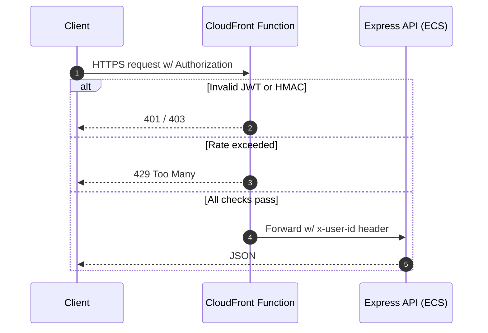

# Chapter 8 – Edge Authentication & CDN Strategy

*Time to read: 15 min*  
*Prerequisites: Chapter 7 (Scaling & Cost), ADR-0004*

## 8.1 Why Edge Auth?

Picture a nightclub bouncer. You don't want uninvited guests clogging the dance floor; you stop them at the door. Likewise, we authenticate requests at CloudFront's edge PoPs so that:

1. **Latency** stays low – bad tokens are rejected in <1 ms without a round-trip to origin.  
2. **Cost** drops – no bandwidth or Lambda time wasted on junk traffic.  
3. **Security** improves – credential stuffing, replay, and DDoS get blocked globally.

## 8.2 Tool Chest

| Layer | Tech | Why? |
|-------|------|------|
| CDN   | CloudFront | 450+ PoPs, free TLS, origin shields |
| Edge Compute | CloudFront **Functions** | Sub-ms JS; cheaper than Lambda@Edge |
| Token Sign | `ES256` JWT (Key ID rotation) | Small payload, mobile-friendly |
| Rate Limit | Sliding window in function code | No Redis needed |
| Secrets | KMS-encrypted CI artifacts | JWKS baked into bundle |

## 8.3 High-Level Flow

## 8.4 Implementation Steps

1. **Bundle tiny verifier** – `npm run edge:build` tree-shakes `jose` down to < 8 KB.  
2. **Terraform** – module `cloudfront-edge-auth` creates the function, publishes version, and attaches to *viewer-request* event.  
3. **CI** – GitHub Action signs the artefact with OIDC and uploads via `aws cloudfront create-function`.  
4. **Origin trust** – API middleware reads `x-user-id` & `x-scope` headers set by edge; skips JWT parsing.

## 8.5 Monitoring & Alerting

* **Grafana Dashboard** (see `grafana/edge_auth.json`): RPS, 4xx %, p95 compute ms.  
* **Loki LogQL**: `| json | status=="4xx"` to audit blocked IPs.  
* Alert if 401 rate > 5 σ above baseline (might indicate auth outage).

## 8.6 Self-Quiz

1. Why are CloudFront Functions cheaper than Lambda@Edge?  
2. What attack classes get mitigated before reaching the origin?  
3. How does the bouncer analogy break down if keys are leaked?  
4. List two ways to rotate JWKS without breaking clients.

---
*Last updated 2025-06-16* 