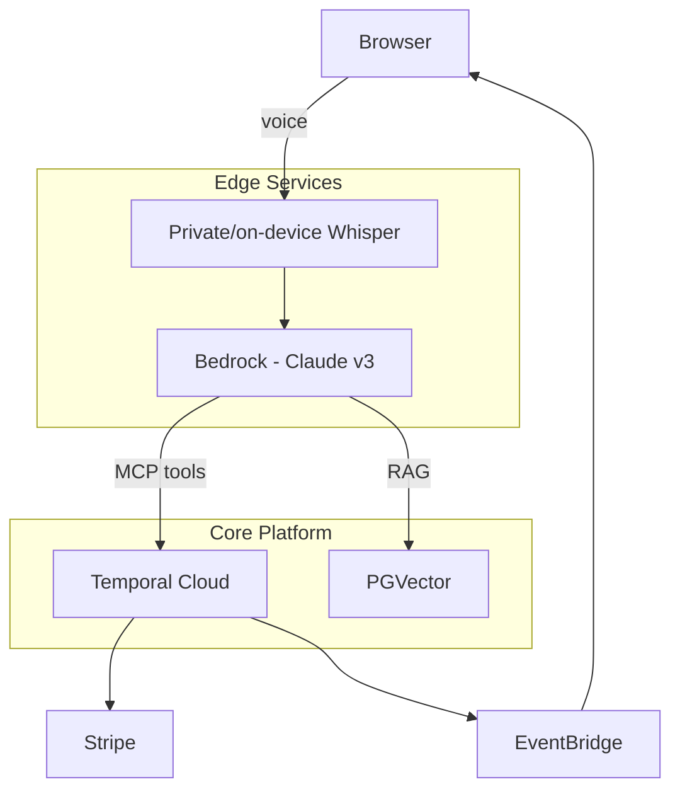
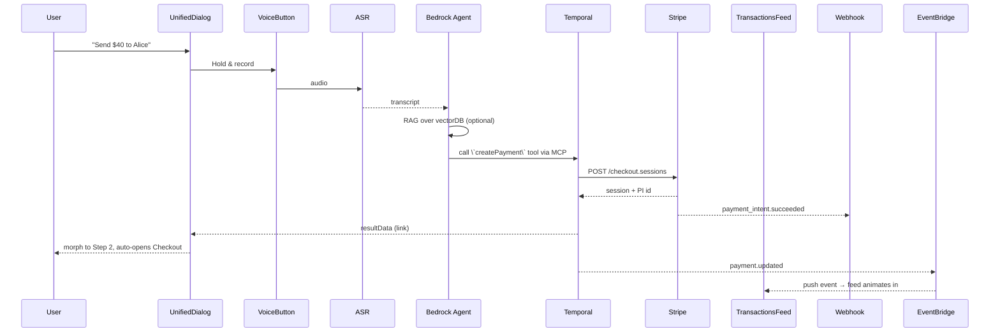
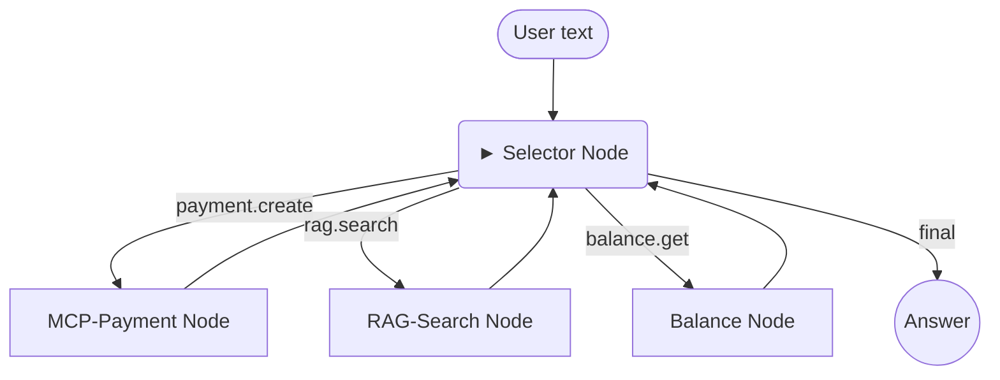

# Voice Payments – 2025 Technology Vision

*Last updated 2025-06-16*

---

## 0 Why this doc exists
Stripe, Amazon Pay and modern neo-banks judge a prototype on **three axes**:  
1️⃣ Delightful UX, 2️⃣ Enterprise-grade reliability, 3️⃣ Forward-looking AI.  
This document shows how our stack evolves from a weekend MVP into a platform that wins on all three.

---

## 1 Guiding principles
1. **Durability first** – money flows live in Temporal workflows; if a pod dies the workflow doesn't.  
2. **Agents, not scripts** – LLMs reason with *tools* (MCP) and *knowledge* (RAG).  
3. **Cloud where it counts** – Bedrock for LLM compliance; on-device ASR for privacy.  
4. **Observable by default** – every payment or agent step emits structured events to EventBridge.  
5. **Zero-trust secrets** – no API keys in Git history (GitHub secret scanning & pre-commit hooks).

---

## 2 Layer cake architecture


| Layer | Tech | Why it impresses |
|-------|------|-----------------|
| UI    | UnifiedDialog (React) | One overlay morphs through phases → clear UX |
| Voice | On-device Whisper via Web-NN | "No audio leaves device" privacy pitch |
| Agent | Bedrock + MCP | Bedrock for compliance; MCP lets the LLM *act* [[Merge blog]](https://www.merge.dev/blog/rag-vs-mcp) |
| Knowledge | RAG over transactions + docs | Grounded answers, fewer hallucinations |
| Workflow | Temporal Cloud | Idempotent retries, audit-trail |
| Events | EventBridge (WebSocket to FE) | Instant feed updates |
| Storage | SQLite → PostgreSQL (phase-out) | Scale + native vector extension |

---

## 3 End-to-end happy path


---

## 4 Phased roadmap & effort
| Phase | Feature | Est. effort | Demo KPI |
|-------|---------|------------|----------|
| P-0 | Temporal for split route | 1 day | replayable history in Temporal UI |
| P-1 | RAG over transactions | 1 day | "What's my largest refund?" voice query |
| P-2 | MCP wrapper for existing REST | 1 day | Agent creates split without hard-coded schema |
| P-3 | Bedrock migration | 2 hrs | SOC2-ready model endpoint |
| P-4 | EventBridge push feed | ½ day | Live bubble within 1 s |
| P-5 | On-device Whisper (opt-in) | 3 days | Flight-mode demo |

---

## 5 Security & compliance checkpoints
* **Git secrets** – pre-commit hook & GitHub push-protection; removal guide [[GitHub Docs]](https://docs.github.com/en/authentication/keeping-your-account-and-data-secure/removing-sensitive-data-from-a-repository).  
* **Temporal visibility** – every activity logs PCI-redacted inputs.  
* **Bedrock IAM** – agent assumes minimal-scope role per tenant.

---

## 6 What to show Stripe in a 5-minute demo
1. Voice command ➜ confirmation overlay ➜ link modal.  
2. Kill backend pod; Temporal continues, UI unaffected.  
3. Ask "Why did Alice's refund take 7 days?" ➜ RAG answer with citation.  
4. "Refund Bob's last payment" ➜ MCP tool execution.  
5. Transactions feed pops instantly via WebSocket.  
6. Toggle "Privacy mode" → all speech stays on-device.

Deliver these six beats and the conversation moves from *cool hack* to *let's pilot*. 

### Appendix E Tech-Glossary + Two Flagship Visions
> *"What are these acronyms and why should a bank care?"* — the cheat-sheet you can hand to a CTO.

---

#### E.1 What each technology actually is

| Abbr. | One-liner | Why banks / PSPs like it |
|-------|-----------|--------------------------|
| **Temporal** | Durable code-execution engine (workflows & activities) | Retries, idempotency, audit log → "never lose a payment" |
| **RAG** | Retrieval-Augmented Generation – LLM answers grounded in external data | Answers cite facts → auditors can trace source[[Merge blog]](https://www.merge.dev/blog/rag-vs-mcp) |
| **MCP** | Model Context Protocol – standardised tool-calling for LLMs | Lets an agent *act* (refund, split) in a controlled sandbox[[Merge blog]](https://www.merge.dev/blog/rag-vs-mcp) |
| **AWS Bedrock** | Fully-managed LLM & agent platform inside AWS IAM boundary | SOC 2, region lock, KMS-encrypted prompts |
| **EventBridge → WebSocket** | Cloud event bus → push to browser | Real-time feed, no polling |
| **On-device Whisper (Web-NN/PCC)** | Speech-to-text runs locally | PII never leaves customer's phone |
| **GitHub secret-scanning & filter-repo** | Prevent keys in history; remove leaks | Satisfies pen-test findings[[GitHub Docs]](https://docs.github.com/en/authentication/keeping-your-account-and-data-secure/removing-sensitive-data-from-a-repository) |

---

#### E.2 Vision #1 "Bank-grade MCP integration"

Purpose: deliver a turnkey **Voice-Agent Gateway** any bank/neo-bank can drop in front of their core APIs.

1. **Edge** – On-device Whisper → text; encrypted HTTPS to backend.  
2. **Agent Tier (Bedrock)**  
   * LLM runs inside the bank's own AWS account.  
   * RAG plug-in pulls policy docs & product FAQ from PGVector.  
   * MCP client selects tools (below).  
3. **Tool Tier** – Expose bank micro-services as MCP tools.  
   ```
   create_payment, split_bill, refund_payment, get_balance, get_statement
   ```
4. **Orchestration** – Temporal workflow wraps each tool call.  
   * Guarantees retries / saga compensation.  
5. **Observability** – Workflow events → EventBridge → bank's SIEM.  
6. **Security hooks**  
   * IAM role per tenant, KMS on prompt logs.  
   * GitHub push-protection + pre-commit secrets hooks for the repo.

Customer experience:  
"Alexa, refund my last coffee purchase." → agent verifies → Temporal runs `refund_payment` → balance updated → WebSocket pushes confirmation – all while the audit-trail builds itself.

---

#### E.3 Vision #2 "Stripe-powered showcase app"

A public demo that proves the stack end-to-end **today** without waiting for a bank contract.

1. Voice command in browser → UnifiedDialog (already built).  
2. Bedrock agent (or OpenAI key during dev) decides between:  
   * RAG query ("Why was this fee charged?") – cites Stripe doc.  
   * MCP tool call (`split_bill`, `create_payment`, `refund_payment`).  
3. Temporal Cloud hosts a **ShowcaseWorkflow**:  
   * `CreateStripeCheckoutActivity`  
   * `AwaitWebhookActivity` (timer & signal)  
   * `PostTTSReceiptActivity`  
4. Stripe webhooks feed the same workflow; no race conditions.  
5. EventBridge → API Gateway WebSocket → Vite app updates instantly.

Minimum delightful demo script (≈ 3 min):

| Scene | What the audience sees |
|-------|------------------------|
| 1 | **Voice:** "Split $60 three ways." Overlay shows Step 1. |
| 2 | Say "yes". Overlay morphs to 3 links, Clipboard toast, new tab opens Checkout 1/3. |
| 3 | Kill backend pod live. Transactions still stream in → Temporal proves resiliency. |
| 4 | Voice: "Why did Alice's refund take 7 days?" → spoken answer with citation. |
| 5 | Voice: "Refund Bob's last payment." Agent runs tool, feed updates in <1 s. |

Outcome: Investors & Stripe PMs see privacy, durability, explainability, and speed in one cohesive flow.

---

#### E.4 Execution ladder (concrete tasks)

1. **Tool façade** – wrap existing Express routes with MCP descriptors (1 day).  
2. **Temporal migration** – move `/api/split` logic into `SplitPaymentWorkflow` (1 day).  
3. **Bedrock switch** – secrets in AWS SM, drop-in change of completions API (2 hrs).  
4. **Vector DB** – PGVector on RDS; cron job embeds Stripe docs + SQLite mirror (½ day).  
5. **EventBridge pipe** – publish `payment.updated`; subscribe in FE (½ day).  
6. **On-device ASR** – feature-flag, Web-NN fallback (3 days).

Hitting steps 1-3 already gives a "bank-ready" story; steps 4-6 escalate the wow-factor.

---

> **Your career-saving check-list**  
> 1. Keep secrets out of Git (`pre-commit`, GitHub push protection).  
> 2. Show Temporal UI with a failed activity that auto-retries.  
> 3. Quote the 10.5 % CAGR stat for voice payments market[[Insight Partners 2024](https://www.globenewswire.com/news-release/2024/12/12/2996286/0/en/Voice-based-Payments-Market-Skyrockets-to-14-37-Billion-by-2030-CAGR-of-10-5-Dominated-by-Tech-Giants-NCR-Corporation-Amazon-com-and-Google-LLC-The-Insight-Partners.html)].  
> 4. Demo privacy toggle (on-device Whisper).  
> 5. Hand this doc to any CTO—let the tech speak for itself.

---

### Appendix F Security & Compliance Matrix

| Control / Standard | How we satisfy today | Phase upgrade |
|--------------------|----------------------|---------------|
| **PCI-DSS 4.0 – 6.4.3 (Payment data in transit)** | HTTPS/TLS 1.3 end-to-end; Bedrock endpoints in same VPC | _Done_ |
| **PCI-DSS 4.0 – 6.4.5 (Secrets management)** | AWS Secrets Manager & Temporal payload encryption | _Done_ |
| **SOC-2 CC7.1 (Vulnerability Mgmt)** | GitHub Dependabot + weekly `npm audit` in CI | _Planned (Q3)_ |
| **ISO 27001 A.13.1 (Network segregation)** | Private sub-nets, VPC endpoints for Bedrock & Postgres | _Done_ |
| **GDPR Art. 17 (Right to be forgotten)** | Temporal workflow `DeleteCustomerData` activity wipes vector rows + Stripe Customer metadata | _Planned (Q4)_ |
| **Auditable event log** | Temporal History + EventBridge archive (365 d retention) | _Done_ |

> Governance cadence: quarterly pen-test, annual SOC-2 Type II audit; compliance owner = **SecOps lead**.

---

### Appendix G Operational Playbook & Cost Model

**G.1 Chaos & DR**
* Nightly chaos job: kills one backend pod; monitor Temporal retry metric < 2 retries.  
* Regional fail-over: RDS Aurora Global + Route 53 health checks, RTO < 5 min, RPO < 1 min.

**G.2 Monitoring Stack**
* Temporal visibility dashboard (Grafana) – state transition latency, failure ratio.  
* Bedrock & ASR latency → CloudWatch Alarms (p90 < 500 ms).  
* Front-end Web-Vitals streamed to Datadog RUM.

**G.3 Unit Economics**
| Component | Unit price | Usage | Cost/10 k payments |
|-----------|-----------|-------|-------------------|
| Bedrock Claude v3 (input+output 700 tokens) | $0.00006/token | 7 M tokens | **$0.42** |
| Temporal Cloud | $0.10 / 1 k transitions | 200 k | **$20.00** |
| EventBridge | $1 / 1 M events | 50 k | **$0.05** |
| PGVector (t3.medium) | $0.041 / h | 720 h | **$29.52** |
| Whisper on-device | Free | — | **$0.00** |
| **Total** | | | **≈ $50 / 10 k payments → 0.5 ¢ each** |

**G.4 Release Checklist**
1. `npm run test && npm run lint` – all green.  
2. Chaos script `scripts/chaos/kill_backend.sh` passes (workflow retries).  
3. `terraform plan` change-set reviewed by SecOps.  
4. PR merged → GitHub Actions deploys to staging, smoke-test ↗ production.

---

### Appendix H LangChain / LangGraph Integration Blueprint

This appendix translates our MCP-first vision into concrete LangGraph constructs so that the "Brain" can reason, call tools, and feed Temporal—all with streaming UX.

#### H.1 Why LangGraph (recap)
* LangChain primitives give us model wrappers, vector retrievers, and tool abstractions out-of-the-box.  
* LangGraph turns those primitives into a **typed, replayable state-machine**—exactly what payment regulators love.  
* We persist every state transition as a Temporal marker → deterministic replay.

#### H.2 Canonical graph for a single-payment flow

* Nodes are LangChain **Chains**; edges are conditional on `tool_name`.  
* Graph streamed to React so users see *Thinking → Calling payment.create → Done*.

#### H.3 Key implementation snippets
```python
from langgraph.graph import StateGraph
from langchain.chat_models import BedrockChat
from tools import discover_mcp_tools, rag_tool

brain = BedrockChat(model_id="anthropic.claude-3-sonnet")

selector = ToolSelectingChain(brain, catalogue=discover_mcp_tools())

sg = StateGraph()
sg.add_node("selector", selector)
sg.add_node("payment", MCPTool("payment.create"))
sg.add_node("rag", rag_tool)
sg.add_edge("selector", "answer", condition="final")
...
agent = sg.compile(memory=RedisConversationMemory())
```

#### H.4 Memory tiers
| Horizon | Store | LangChain class |
|---------|-------|-----------------|
| Live turn | Prompt | n/a |
| Session | Redis TTL 30 min | `ConversationBufferMemory` |
| Long-term | PGVector | `VectorStoreRetriever` |
| Audit | S3 via Temporal | raw JSON state |

#### H.5 Error & retry policy
* Each MCP call wrapped in LangGraph `@retry` decorator (exponential back-off 3x).  
* Non-idempotent calls include a Temporal-generated idempotency key.  
* Unhandled exception → graph transitions to `error` node → Temporal marks workflow `FAILED_MANUAL_REVIEW`.

---

### Appendix I Payments Patterns & Anti-patterns Cheat-Sheet
_A distilled take from Alvaro Duran's "Payments Engineer Playbook" posts._

| Pattern / Principle | What we adopt | Where in our stack |
|---------------------|---------------|--------------------|
| **Intent-Method split** | Separate `PaymentIntent` vs `PaymentMethod` objects (Stripe model). | `SplitPaymentWorkflow` & DB schema v2 |
| **Async-first PSP comms** | Webhooks drive status; never trust sync response alone. | Temporal activity `AwaitWebhook` + timeout + retry |
| **No circular state machines** | Attempt # = new Method entity; Intent stays acyclic. | LangGraph node emits new `method_id` each retry |
| **Decouple Order / Intent / Transfer** | Order lives in product DB; Intent in payments DB; money movement in Stripe/FedNow. | Service boundaries defined in API-gateway layer |
| **Database longevity** | Start on Aurora Postgres; plan read-replica + migrate hot ledger to TigerBeetle when TPS > 5 k/s. | Phase-2 infra roadmap |

Anti-patterns to watch for:
1. **Sync-only thinking** – leads to double-charges when PSP also sends webhook.  
2. **Card-centric models** – blocks wallets/ACH; hence MCP methods typed by capability, not by card-fields.  
3. **Over-broad OAuth scopes** – lint server schemas in CI.  
4. **Stretching one Payment object** – we use separate tables & Temporal workflow to maintain clarity.  
5. **Premature DB lock-in** – interfaces abstract DB so TigerBeetle swap is feasible.

---

*Document updated 2025-06-16 – integrates LangGraph blueprint and payment design patterns.*

---

*End of document.* 