# Agent X – Voice-Driven Banking & Payments MVP Specification

> Version: 0.1 — 2025-06-16  
> Authors: Rehan Vishwanath, Payment AI Team

---

## 1 Purpose
Agent X is a **voice-first private & personal banking assistant** that executes money movement and insight tasks through conversational interactions. This document captures **every moving part** for the initial MVP: intents, dialogue flows, edge-cases, data contracts, orchestration graphs, Temporal workflows, memory design, and infra components.

## 2 Use-Case Catalogue
| # | Use Case | One-liner | Confirmation | Notes |
|---|----------|-----------|--------------|-------|
| U1 | Money Transfer | "Send Rehan 25 dollars" | Explicit yes/no | Reject if funds < amount |
| U2 | Bill Splitting | "Split 120 three ways with Aman and Ravi" | Group confirm once | Wait for all payments to settle |
| U3 | Transaction History | "What were my last five transactions?" | Implicit | Reads from ledger view |
| U4 | Bill Prediction | "What's my hydro bill next month?" | N/A | RAG over past bills |
| U5 | Inter-Account Transfer | "Move 200 from checking to savings" | Explicit | Check min balance, intrabank |
| U6 | Contact Recognition | "Send mom 50" | Explicit | Disambiguate if >1 match |
| U7 | Recurring Payment Setup | "Pay rent 1800 every month" | Explicit | Creates Temporal cron workflow |
| U8 | Subscription Tracking | "List my subscriptions" | Implicit | Detect recurring merchants

### 2.1 Detailed Flow Templates
For brevity U1 & U2 shown; others follow same template.

#### U1 Money Transfer
1 User: "Send Rehan twenty-five."  
2 ASR → text.  
3 `TransferIntent` detector extracts `{payee:"Rehan", amount:25}`.  
4 `ResolveContactTool` → `acct_id=987`.  
5 Funds check (`BalanceTool`) ⇒ OK.  
6 **Confirm**: "You're about to send $25 to Rehan Checking (balance $812). Confirm?"  
7 User: "Yes."  
8 `CreateTransferTool` posts ledger; Temporal guarantees idempotency.  
9 TTS: "Done! Transfer ID TB-6313."

*Edge-cases*: homonym contacts, insufficient funds, network retry, duplicate yes.

#### U2 Bill Splitting (Dutch)
Planner decomposes into N parallel `TransferIntent`s. Parent workflow waits `Promise.all(child.complete)`. If any child fails within 24 h, parent refunds completed legs.

---

## 3 Conversation & Orchestration

### 3.0 LangGraph Core Concepts
Before diving into nodes and edges, two clarifications:

#### 3.0.1 What is a LangGraph *DAG*?
+1. **LangGraph** – An LLM-centric library (JS/Py) that lets you wire nodes into a *stateful, possibly cyclic* graph.
+2. **DAG (Directed Acyclic Graph)** – Classical Airflow-style chain: every node runs once, no loops.
+3. **Cyclic extension** – LangGraph lets edges point *back* (e.g., Validator → Planner) yet still statically compiles to a safe graph that must reach `END`.
+4. **Why here?** – Voice-banking needs clarifications (*ambiguous payee → reprompt → re-plan*). Cycles solve this without nested `if/else`.

#### 3.0.2 Planner → Actor → Validator (P-A-V) Pattern
| Stage | Analogy | Responsibility | Typical Failure Caught |
|-------|---------|----------------|------------------------|
| **Planner** | Project manager | Ask LLM to convert raw utterance + memory into an *ordered list of tool calls* (JSON). | Hallucinated tool, missing arg |
| **Actor** | Field operator | Execute exactly one tool via gRPC/Temporal; return structured result. | Network, Stripe error, idempotency retry |
| **Validator** | QA & Compliance | 1) Zod schema check 2) business rule guard 3) decide whether to loop, confirm, or finish. | Overdraft, AML limit, schema mismatch |

This triad keeps reasoning, side-effects, and guardrails separated, shrinking blast-radius for each concern.

---

### 3.1 End-to-End Sequence (“Send Mom $50”)

```mermaid
sequenceDiagram
    autonumber
    actor User as "User (voice)"
    participant Mic   as RN Mic Button
    participant CF    as CloudFront Fn
    participant API   as Express /voice-api
    participant LG    as LangGraph Runtime
    participant Plan  as Planner (GPT-4o)
    participant Act   as Actor (Temporal)
    participant Val   as Validator
    participant Cnt   as ContactSvc
    participant Bal   as AccountSvc
    participant Ledg  as LedgerSvc
    participant TB    as TigerBeetle
    participant TTS   as Polly

    User->>Mic: "send mom fifty"
    Mic->>CF: POST /intent {text}
    CF-->>Mic: 202 ✓JWT
    CF->>API: forward
    API->>LG: invoke(state)
    LG->>Plan: Planner node
    Plan-->>LG: plan=[ResolveContact,BalanceCheck,CreateTransfer]
    LG->>Act: ResolveContact
    Act->>Cnt: Resolve("mom")
    Cnt-->>Act: acct_id=123
    Act-->>LG: result
    LG->>Val: validate step
    Val-->>LG: ok
    LG->>Act: BalanceCheck
    Act->>Bal: GetBalance(CHK)
    Bal-->>Act: 812
    Act-->>LG: ok
    LG->>Val: confirm needed?
    Val-->>LG: yes
    LG-->>API: ask user confirm
    API-->>Mic: prompt TTS
    User->>Mic: "yes"
    Mic->>API: /confirm yes
    API->>LG: continue=yes
    LG->>Act: CreateTransfer
    Act->>Ledg: CreateTransfer()
    Ledg->>TB: post double-entry
    TB-->>Ledg: txid
    Act-->>LG: txid
    LG->>Val: final validation
    Val-->>LG: done
    LG-->>API: success event
    API->>TTS: "Done!"
    TTS-->>User: speech
```


---

### 3.1 LangGraph DAG (high-level)

*Nodes*
* **ASR** – Remote Whisper streaming (OpenAI).  
* **IntentDetect** – regex & embedding classifier.  
* **Planner** – GPT-4o returns ordered tool calls.  
* **Actor** – Executes next tool via gRPC to Temporal Worker.  
* **Validator** – Zod schema check, business guards.  
* **Confirmer** – Prompt that asks yes/no.  
* **TTS** – Polly/Piper.

### 3.2 Node → Tool Mapping
| Tool | Description | gRPC Service | Temporal Activity |
|------|-------------|--------------|-------------------|
| `ResolveContactTool` | Fuzzy map alias → account | `contacts.v1.ContactSvc/Resolve` | 🗸 |
| `BalanceTool` | Fetch account balance | `core.v1.AccountSvc/GetBalance` | 🗸 |
| `CreateTransferTool` | Post double-entry | `ledger.v1.LedgerSvc/CreateTransfer` | 🗸 |
| `GetHistoryTool` | List last N txns | `ledger.v1.LedgerSvc/ListTransfers` | 🗸 |
| `PredictBillTool` | RAG prediction | `insights.v1.Predictor/PredictBill` | 🗸 |
| `SetupRecurringTool` | Cron workflow | `scheduler.v1.Recurring/Create` | 🗸 |
| `ListSubscriptionsTool` | Detect recurring | `insights.v1.Subscriptions/List` | 🗸 |

---

## 4 Protocols & APIs

### 4.1 gRPC IDL Snippets (proto-ish)
```protobuf
service ContactSvc {
  rpc Resolve(ResolveReq) returns (ResolveResp);
}
message ResolveReq { string alias = 1; }
message ResolveResp { string account_id = 1; repeated string candidates = 2; }

service LedgerSvc {
  rpc CreateTransfer(CreateReq) returns (CreateResp);
  rpc ListTransfers(ListReq) returns (ListResp);
}
```
*All services implement **idempotency_key** header; retries by Temporal are safe.*

### 4.2 Temporal Workflows
* `TransferWorkflow(id, from, to, amt)`  
  – Activities: `CheckFunds`, `PostTigerBeetle`, `PersistAurora`, `EmitEvent`.  
* `SplitWorkflow(group_id, rows[])`  
  – Spawns `TransferWorkflow` children, aggregates.

---

## 5 Memory Strategy (MVP)
| Layer | Backing Store | TTL | Contents |
|-------|---------------|-----|----------|
| Short-term | Redis `chat:*` list | 30 min | recent turns |
| Semantic | RedisHash `facts:*` | 7 d | contacts, last amounts |
| Long-term | Postgres + pgvector | ∞ | txn embeddings for RAG |

*Why?* Redis is already used by LangGraph; using it for short/semantic keeps latency <3 ms. Long-term analytics live in Aurora anyway, so pgvector is trivial.

---

## 6 Infrastructure

*Worker Pods* run:
* Temporal worker runtime
* Stripe SDK, Ledger adapter, Insights.

Autoscale via KEDA on Temporal queue length.

---

## 7 Edge Cases & Error Handling
* ASR low confidence → ask repeat.  
* Duplicate "yes" → idempotency key ignores.  
* Partial split payments timeout → auto-refund via compensating workflow.  
* Contact ambiguity ≥3 matches → escalate to UI picker.

---

## 8 Developer Tooling (MCP)
| Concern | Tool | Why |
|---------|------|-----|
| Local dev | **MCP Dev Container** | ships Redis, Temporal, TigerBeetle, ngrok mock |
| Lint/CI | **mega-check-push** | ESLint, proto-lint, OpenAPI diff |
| VS Code | **Doc Writer Profile** [link](https://code.visualstudio.com/docs/languages/markdown) | Markdown preview, Mermaid highlight |
| Observability | Grafana dashboards (`langgraph_temporal.json`) | p95 tool latency, worker errors |

---

## 9 Glossary (Everything Defined)
* **ASR** – Automatic Speech Recognition (OpenAI Whisper API).  
* **LangGraph** – Typed DAG executor for LLM agents.  
* **Temporal** – Durable execution engine; guarantees exactly-once.  
* **Tool** – A callable business capability exposed to the LLM.  
* **Worker** – Pod running Temporal activities + domain SDKs.  
* **RAG** – Retrieval Augmented Generation; combines vector search + LLM.  
* **TigerBeetle** – High-TPS double-entry ledger.  
* **Edge-Auth** – CloudFront Function performing JWT verification.  
* **MCP** – "Modern Coding Playbook" dev-container, lint, etc.

---

## 10 Next Steps
1 Implement proto files & generate stubs.  
2 Scaffold LangGraph DAG with three tools.  
3 Write Temporal activities with idempotency.  
4 Deploy dev-stack via `docker compose up dev`.  
5 Create Grafana dashboard.

---

### 6.1 Technology Cheat-Sheet (Runtime Stack)
| Layer | Tech | Reason |
|-------|------|--------|
| ASR | **OpenAI Whisper API** | Cloud inference → no on-device load |
| Edge Auth | **CloudFront Function** | Sub-ms JWT verify, rate-limit bots |
| Graph Engine | **LangGraph JS** | Cyclic control, easy node composition |
| LLM | **GPT-4o** (Planner) | High reasoning quality for plans |
| Memory (short) | **Redis** | LangGraph state backend, 3 ms P99 |
| Orchestration | **Temporal** | Exactly-once activity semantics |
| Tool RPC | **gRPC + protobuf** | Strong typing, low latency |
| Ledger | **TigerBeetle** | 4 M tx/s, provable double-entry |
| OLTP / Vector | **Aurora Postgres + pgvector** | Relational entities & RAG embeddings |
| TTS | **AWS Polly** | Fast neural voices, multi-lang |
| Observability | **Prometheus + Grafana** | Dashboards & alerts |

---

## 11 Recap & Key Take-Aways
1. **LangGraph DAG** gives us loops without spaghetti logic, perfect for conversational flows.  
2. **Planner → Actor → Validator** separates reasoning, side-effects, and guardrails, making audits and debugging straightforward.  
3. Exact-once money movement is guaranteed by **Temporal** + **TigerBeetle** idempotency keys.  
4. Everything heavy (ASR, LLM) stays in the cloud, so the mobile client remains thin—no on-device Whisper.  
5. The full sequence diagram maps every call, making performance budgeting and threat-modelling easy.  
6. The tech stack is intentionally boring-but-bulletproof: Redis, gRPC, Postgres, Prometheus.

---

> **End of file** 