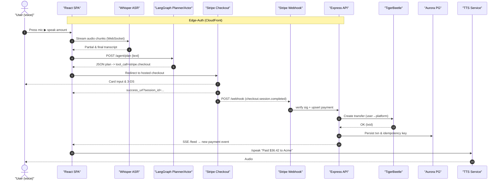

# End-to-End Payment Flow (Voice → Ledger)

The diagram below illustrates every moving part from the moment a user presses the microphone in the SPA to when the double-entry ledger is updated and the UI speaks back the confirmation.

## Legend
* **Edge-Auth**: CloudFront Function validates JWT/HMAC before requests hit `Frontend` or `Backend` origins.
* **Aurora** stores business entities (users, invoices, split rules) while **TigerBeetle** guarantees balanced transfers.

## Why this matters
Visualising latency-critical hops (bold arrows) helps set SLAs: ASR < 300 ms, Agent < 1.5 s, Stripe redirect path depends on user.

---
*Generated: 2025-06-16* 