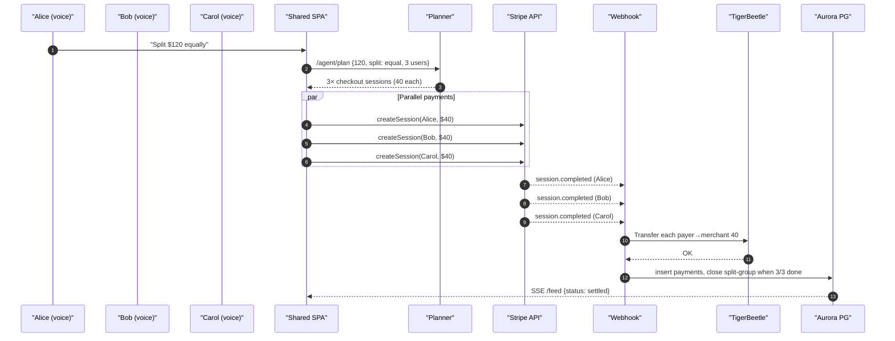

# Split-Bill Flow (Three Friends at Dinner)

### Key Points
* Flow shows **parallel** payments; ledger posts only when each webhook event arrives to ensure atomicity.
* Agent tracks `split_group_id`; once Aurora marks the group complete, front-end updates UI.

---
*Generated: 2025-06-16* 