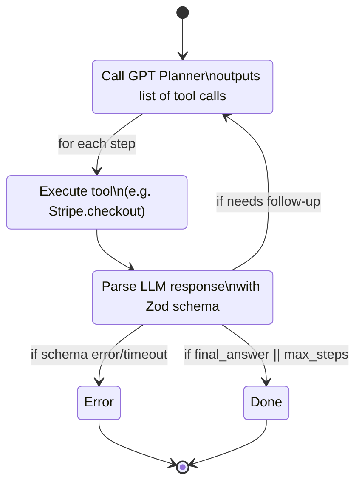

# Agent Planner–Actor–Validator Loop

## Explanation
1. **Plan** – The agent asks GPT‐4 to produce a step plan given the user intent.
2. **Act** – The executor runs the next tool (Stripe, Ledger, etc.).
3. **Validate** – The validator checks the JSON schema & business rules.
4. **Loop** – If more steps remain and max depth not reached, go back to Plan with updated context.

### Guardrails
* `max_steps` set to 8 to avoid infinite loops.  
* Each tool call wrapped in `retry(3, exponential)` decorator.  
* On schema failure, we surface an apology to the user and log the trace for replay.

---
*Generated: 2025-06-16* 